# Ecossistema de Fontes de Dados Fundiários, Espaciais e Sociojurídicos

Este documento centraliza o inventário de dados da **Plataforma de Mapeamento e Resolução de Conflitos Fundiários de Pernambuco**. Ele categoriza as fontes de dados em **camadas de cruzamento topológico/espacial** e **camadas de cruzamento sociojurídico/processual**, detalhando tanto as bases já integradas e processadas no PostGIS quanto o roteiro e requisitos técnicos para as futuras integrações.

---

## 1. Visão Geral das Camadas e Status de Ingestão

### Camada 1: Cruzamentos Topológicos Espaciais (Geometria, Limites e Posse)

| Código | Fonte de Dados | Órgão / Sistema | Finalidade Territorial | Status de Ingestão |
| :---: | :--- | :--- | :--- | :---: |
| **a** | **SIGEF** | INCRA | Imóveis rurais certificados federais |  **Importado** |
| **b** | **CAR / SICAR** | MMA / Órgãos Estaduais | Cadastros ambientais rurais, APPs e reservas |  **Importado** |
| **c** | **MapBiomas Alertas** | MapBiomas / Obs. Clima | Alertas validados de desmatamento (`alerts_with_intersections`) |  **Importado** |
| **c.1** | **MapBiomas CAR Alertas** | MapBiomas / Obs. Clima | Imóveis CAR com sobreposição a alertas (`car_with_alerts_and_intersections`) |  **Importado** |
| **d** | **Terras Tradicionais** | FUNAI / INCRA | Terras Indígenas e Territórios Quilombolas |  **Importado** |
| **e** | **Unidades de Conservação (UCs ICMBio)** | ICMBio / CNUC | Áreas federais de Proteção Integral e Uso Sustentável |  **Importado** |
| **e.1** | **Áreas Embargadas (ICMBio)** | ICMBio / MMA | Polígonos de embargos ambientais e restrição de uso |  **Importado** |
| **e.2** | **Autos de Infração (ICMBio)** | ICMBio / MMA | Autos de infração ambiental georreferenciados |  **Importado** |
| **h** | **SIPRA** | INCRA | Assentamentos e projetos de reforma agrária federais | ⏳ **A Importar** |
| **i** | **Moradia Legal** | TJPE | Núcleos urbanos/rurais em regularização fundiária (REURB) | ⏳ **A Importar** |
| **j** | **Acervo Fundiário ITERPE** | ITERPE (via ACT) | Glebas estaduais, terras devolutas e regularização rural | ⏳ **A Importar** |

---

### Camada 2: Cruzamentos Sociojurídicos e Processuais (Alertas, Litígios e Atribuição)

| Código | Fonte de Dados | Órgão / Entidade | Finalidade Sociojurídica | Status de Ingestão |
| :---: | :--- | :--- | :--- | :---: |
| **f** | **DataJud** | CNJ / TJPE / TRF5 | Processos judiciais ativos de litígio fundiário e posse |  **Importado** |
| **g** | **DespejoZero** | Campanha Despejo Zero | Mapeamento comunitário de áreas sob risco ou ameaça de despejo | ⏳ **A Importar** |
| **h** | **ONR** | Operador Nacional (SREI) | Registro eletrônico de imóveis e cadeia de matrículas | ⏳ **A Importar** |

---

## 2. Fontes Já Integradas no Banco de Dados (PostGIS)

Todas as bases abaixo já passam pelo pipeline ETL automatizado (`src/etl.py` e `src/etl_datajud.py`), são filtradas espacialmente para os limites de Pernambuco (EPSG:4326), indexadas espacialmente via GIST e distribuídas como Vector Tiles (MVT) através do servidor Martin.

### 2.1. Camada 1: Cruzamentos Topológicos Espaciais

#### a. SIGEF — Sistema de Gestão Fundiária (INCRA)
* **Status:** **Importado e Ativo**
* **Tabelas PostGIS:** `public.sigef_privado_pe` (21.187 polígonos) e `public.sigef_publico_pe` (2.826 polígonos).
* **Descrição:** Imóveis rurais certificados pelo INCRA com georreferenciamento formal.
* **Atributos Chave:** `codigo_imo`, `nome_imove`, `situacao_i` (`REGISTRADA`, `TITULADA_NAO_REGISTRADA`, `NAO_TITULADA`), `status`, `registro_m` (matrícula cartorária).
* **Aplicação em Conflitos:** Base primária de sobreposições territoriais contra terras públicas, indígenas e quilombolas.

#### b. CAR / SICAR — Cadastro Ambiental Rural (MMA)
* **Status:** **Importado e Ativo**
* **Tabelas PostGIS:**
  * `public.area_imovel_1` (433.105 imóveis rurais declarados).
  * `public.apps_1` (273.296 áreas de preservação permanente).
  * `public.reserva_legal_1` (239.388 reservas legais).
  * `public.vegetacao_nativa_1` (138.475 remanescentes de vegetação).
* **Descrição:** Registro público eletrônico de informações ambientais de imóveis rurais (Lei Federal 12.651/2012).
* **Aplicação em Conflitos:** Detecção de sobreposições de cadastros autodeclarados sobre terras públicas, unidades de conservação e territórios tradicionais.

#### d. Terras Tradicionais (FUNAI & INCRA)
* **Status:** **Importado e Ativo**
* **Tabelas PostGIS:**
  * `public.tis_poligonais`: 16 Terras Indígenas (FUNAI) — etnias Fulni-ô, Pankararu, Truká, Tuxá, Pipipan, Kambiwá, etc.
  * `public.areas_de_quilombolas_pe`: 10 Territórios Quilombolas (INCRA) — 1.276 famílias registradas.
* **Aplicação em Conflitos:** Cruzamento contra limites privados do SIGEF e CAR para geração da tabela agregada de conflitos `public.land_overlaps` e pontos centrais `public.land_overlaps_points`.

#### e. Unidades de Conservação e Fiscalização Ambiental (ICMBio / MMA)
* **Status:** **Importado e Ativo**
* **Tabelas PostGIS:**
  * `public.limiteucsfederais_a`: 10 Unidades de Conservação federais com intersecção em PE (PARNA Catimbau, Fernando de Noronha, REBIO Serra Negra, Saltinho, etc.).
  * `public.embargos_icmbio`: 246 polígonos de áreas sob embargo ambiental do ICMBio em PE (Decreto 6.514/2008).
  * `public.autos_infracao_icmbio`: 861 autos de infração ambiental georreferenciados (pontos) em PE.
* **Aplicação em Conflitos:** Alerta de ocupação ou titulação irregular sobre áreas protegidas federais e restrições legais de uso econômico.

---

### 2.2. Camada 2: Cruzamentos Sociojurídicos e Processuais

#### f. DataJud — Processos Judiciais de Conflitos Fundiários (CNJ / TJPE / TRF5)
* **Status:** **Importado e Ativo**
* **Tabela PostGIS:** `public.processos_conflitos_judiciais` (2.000 processos ativos georreferenciados em Pernambuco) e `public.processos_conflitos_municipios`.
* **Descrição:** Processos judiciais coletivos e individuais em tramitação classificados segundo as Tabelas Processuais Unificadas (TPU) do CNJ e Resolução CNJ 510/2023.
* **Taxonomia dos Conflitos:**
  1. *Reintegração e Conflito de Posse* (TPU 10100, 10434, 10444, 10445, 10446; Classe 1707, 1709).
  2. *Reforma Agrária & Desapropriação* (TPU 10124, 11873, 5995; Classe 90, 91).
  3. *Povos Indígenas & Territórios Quilombolas* (TPU 12031, 10104, 15114).
  4. *Terras Devolutas & Ações Discriminatórias* (TPU 10094, 10451, 10453; Classe 96, 34).
  5. *Usucapião e Regularização de Posse* (TPU 10500 - Lei 6.969/81; Classe 49).
  6. *Conflito Coletivo Rural & Agrário* (TPU 11412, 11413).
* **Interface:** Camada vetorial interativa no mapa com popup de detalhes do processo, link direto para consulta no PJe e painel dedicado de legendas e fundamentos jurídicos (`DatajudLegendComponent`).

#### g. Jurisdições Territoriais & Comarcas / Termos Judiciários (TJPE e JFPE)
* **Status:** **Importado e Ativo**
* **Fontes:** Documentos oficiais do TJPE e JFPE (`data/raw/*.docx`) e malha IBGE 185 municípios (`src/pe_municipios_sedes.json`).
* **Tabelas PostGIS:**
  - `public.jurisdicao_tjpe` (185 vínculos municipais nas 136 comarcas do TJPE).
  - `public.jurisdicao_jfpe` (213 vínculos municipais nas 12 subseções da Justiça Federal).
  - `public.jurisdicoes_pe_municipios` (185 municípios unificados com sedes, comarcas, subseções, varas e coordenadas).
* **Arquivos Exportados:** `data/extracted/jurisdicoes/tjpe_comarcas_municipios.csv`, `jfpe_subsecoes_municipios.csv`, `jurisdicoes_pe_completo.csv`.
* **Resolução Fundiária / Jurídica:** Corrige a distorção onde municípios sem comarca própria ("municípios filhas" ou "termos judiciários", como Iguaracy, Dormentes, Casinhas, Primavera, Xexéu, Granito, etc.) ficavam invisíveis ou com contagem zero de processos. Permite identificar com exatidão a comarca sede responsável, as filhas abrangidas e enriquece os dados do DataJud com metadados de competência territorial e popups informativos.

---

### 3.1. Futuras Fontes — Camada 1: Cruzamentos Topológicos Espaciais

| Código | Fonte | Órgão / Responsável | Formato Esperado | Requisitos de Acesso | Prioridade |
| :---: | :--- | :--- | :--- | :--- | :---: |
| **h** | **SIPRA** | INCRA (Superintendência SR-03/PE) | Shapefile / KML / GeoJSON | Catálogo Acervo Fundiário INCRA | Alta |
| **i** | **Moradia Legal** | Corregedoria Geral da Justiça (TJPE) | Shapefiles / Poligonais KML de REURB | Solicitação / Parceria TJPE | Média |
| **j** | **Acervo ITERPE** | Instituto de Terras e Reforma Agrária de PE | Poligonais das Glebas Estaduais (Shapefile/DWG/KML) | Acordo de Cooperação Técnica (ACT) | Alta |

---

### 3.2. Futuras Fontes — Camada 2: Cruzamentos Sociojurídicos e Processuais

| Código | Fonte | Órgão / Responsável | Formato Esperado | Requisitos de Acesso | Prioridade |
| :---: | :--- | :--- | :--- | :--- | :---: |
| **g** | **DespejoZero** | Campanha Nacional Despejo Zero | GeoJSON / CSV / KML | Dados abertos da sociedade civil | Alta |
| **h** | **ONR** | Operador Nacional do Registro de Imóveis | API REST / Geocódigo de Matrículas / KML | Credenciamento / Convênio ONR | Média |

---

### 3.3. Detalhamento Técnico das Fontes Futuras

### c. MapBiomas (Uso e Cobertura do Solo & Alertas de Desmatamento)
* **Objetivo:** Avaliar o histórico de ocupação, vegetação nativa, consolidação de pastagem/agricultura e desmatamento não autorizado em áreas sob litígio.
* **Subdivisão:**
  1. **MapBiomas Uso e Cobertura:** Série temporal anual (1985–presente) da transição de uso da terra. Permite aferir posse mansa e pacífica, tempo de ocupação e degradação ambiental.
  2. **MapBiomas Alerta:** Polígonos validados de alertas de desmatamento com sobreposição a embargos e autorizações do órgão ambiental.
* **Pipeline Proposto:** Ingestão vetorial dos alertas e relatórios analíticos de cobertura via API do MapBiomas ou processamento zonal no PostGIS (Raster/Vector).

### h. SIPRA — Sistema de Informações de Projetos de Reforma Agrária (INCRA)
* **Objetivo:** Ingestão dos perímetros de Projetos de Assentamento Federais (PA, PDS, PAF, etc.) em Pernambuco.
* **Importância:** Identificação imediata de invasões, fracionamentos ilegais de lotes e pressões fundiárias externas sobre os assentamentos da reforma agrária.
* **Origem dos Dados:** Base cartográfica do INCRA (camada `assentamentos_brasil` filtrada para Pernambuco).

### i. Programa Moradia Legal (TJPE)
* **Objetivo:** Mapeamento dos núcleos urbanos e rurais informais consolidados em processo de Regularização Fundiária (REURB-S e REURB-E) sob a chancela da Corregedoria Geral da Justiça de Pernambuco.
* **Importância:** Evita ordens de desocupação e reintegração de posse sobre núcleos consolidados em regularização social, fornecendo aos magistrados e à comissão fundiária a comprovação imediata de procedimento de REURB em andamento.
* **Origem dos Dados:** Geometrias dos núcleos fornecidas pelos municípios conveniados ao programa Moradia Legal e cadastradas no TJPE.

### j. Acervo Fundiário ITERPE (Glebas e Terras Devolutas Estaduais)
* **Objetivo:** Integração das glebas públicas estaduais discriminadas, arrecadadas ou sob regularização fundiária pelo Instituto de Terras e Reforma Agrária de Pernambuco (ITERPE).
* **Importância:** Fecha a lacuna entre a base federal (SIGEF/INCRA) e as terras estaduais/devolutas de Pernambuco, permitindo verificar conflitos de competência dominial entre Estado e particulares.
* **Origem dos Dados:** Acordo de Cooperação Técnica (ACT) para cessão das bases georreferenciadas do acervo do ITERPE.

### g. Campanha Nacional Despejo Zero
* **Objetivo:** Mapeamento comunitário e colaborativo de comunidades, ocupações urbanas e áreas rurais ameaçadas ou sujeitas a ordens de remoção forçada e despejo.
* **Importância:** Camada de alerta preventivo humanitário e sociojurídico, correlacionando o risco comunitário com ações judiciais catalogadas no DataJud.
* **Origem dos Dados:** Dados geoespaciais e relatórios públicos da articulação Despejo Zero e entidades parceiras (MST, CPT, MTST, FNDR).

### h. ONR — Operador Nacional do Registro de Imóveis Eletrônico
* **Objetivo:** Cruzamento com o Sistema de Registro Eletrônico de Imóveis (SREI/SAEC).
* **Importância:** Verificação da cadeia dominial, identificação de duplicidade de matrículas sobre a mesma poligonal (grilagem cartorial) e consulta da situação de ônus reais e penhoras em cartórios de registro de imóveis de Pernambuco.
* **Origem dos Dados:** Integração com a infraestrutura do ONR / SAEC via web service e protocolo de interoperabilidade geoespacial.

---

## 4. Arquitetura de Cruzamento Multi-Camadas

Quando uma nova geometria (seja via upload de **KML**, GeoJSON ou poligonal de processo judicial) é inserida no sistema, o motor de cruzamento do banco de dados executa a análise em duas frentes:

```mermaid
flowchart TD
    KML[Upload KML / Poligonal de Conflito] --> C1[Cruzamento Topológico - Camada 1]
    KML --> C2[Cruzamento Sociojurídico - Camada 2]

    subgraph "Camada 1: Topologia Espacial (ST_Intersects / ST_Intersection)"
        C1 --> SIGEF[SIGEF / SNCI Imóveis Certificados]
        C1 --> CAR[CAR Imóveis, APPs e Reservas]
        C1 --> TI[Terras Indígenas FUNAI]
        C1 --> QUILOMBO[Territórios Quilombolas INCRA]
        C1 --> UC[Unidades de Conservação ICMBio]
        C1 --> SIPRA[Assentamentos INCRA - A Importar]
        C1 --> ITERPE[Glebas ITERPE - A Importar]
        C1 --> MORADIA[Moradia Legal TJPE - A Importar]
        C1 --> MAPBIO[Uso MapBiomas - A Importar]
    end

    subgraph "Camada 2: Contexto Sociojurídico e Processual"
        C2 --> DATAJUD[DataJud: Ações Judiciais Ativas na Comarca]
        C2 --> EMBARGOS[ICMBio: Autos e Embargos Ambientais]
        C2 --> DESPEJO[DespejoZero: Ameaças Comunitárias - A Importar]
        C2 --> ONR[ONR: Registro de Imóveis / Matrículas - A Importar]
    end

    C1 --> RELATORIO[Relatório Pericial & Diagnóstico de Sobreposições]
    C2 --> RELATORIO
```

---

## 5. Como Atualizar Este Inventário
Sempre que uma nova base for baixada em `data/raw/`, descompactada em `data/extracted/`, processada pelo pipeline ETL e registrada no banco de dados, este documento e o [AGENTS.md](../AGENTS.md) devem ser atualizados conforme as diretrizes do projeto.
