# Ecossistema de Fontes de Dados Fundiários, Espaciais e Sociojurídicos

Este documento centraliza o inventário de dados da **Plataforma de Mapeamento e Resolução de Conflitos Fundiários de Pernambuco**. Ele categoriza as fontes de dados em **camadas de cruzamento topológico/espacial** e **camadas de cruzamento sociojurídico/processual**, detalhando tanto as bases já integradas e processadas no PostGIS quanto o roteiro e requisitos técnicos para as futuras integrações.

---

## 1. Visão Geral das Camadas e Status de Ingestão

### Camada 1: Cruzamentos Topológicos Espaciais (Geometria, Limites e Posse)

| Código | Fonte de Dados | Órgão / Sistema | Finalidade Territorial | Status de Ingestão |
| :---: | :--- | :--- | :--- | :---: |
| **a** | **SIGEF** | INCRA | Imóveis rurais certificados federais |  **Importado** |
| **b** | **CAR / SICAR** | MMA / Órgãos Estaduais | Cadastros ambientais rurais, APPs e reservas |  **Importado** |
| **c** | **MapBiomas Alertas** | MapBiomas / Obs. Clima | Alertas validados de desmatamento (`alerts_with_intersections`) |  **Importado** |
| **c.1** | **MapBiomas CAR Alertas** | MapBiomas / Obs. Clima | Imóveis CAR com sobreposição a alertas (`car_with_alerts_and_intersections`) |  **Importado** |
| — | *MapBiomas Dashboard* | MapBiomas / Obs. Clima | Shapefile simplificado (`dashboard_alerts`) | ℹ️ **Dispensado** (subconjunto de `c`) |
| **d** | **Terras Tradicionais** | FUNAI / INCRA | Terras Indígenas e Territórios Quilombolas |  **Importado** |
| **e** | **Unidades de Conservação (UCs ICMBio)** | ICMBio / CNUC | Áreas federais de Proteção Integral e Uso Sustentável |  **Importado** |
| **e.1** | **Áreas Embargadas (ICMBio)** | ICMBio / MMA | Polígonos de embargos ambientais e restrição de uso |  **Importado** |
| **e.2** | **Autos de Infração (ICMBio)** | ICMBio / MMA | Autos de infração ambiental georreferenciados |  **Importado** |
| **e.3** | **Unidades de Conservação Estaduais** | CPRH / MMA | Áreas estaduais de proteção integral e uso sustentável (APAs, RVS, RPPNs) |  **Importado** |
| **h** | **SIPRA** | INCRA | Assentamentos e projetos de reforma agrária federais (`assentamentos_incra_pe`) |  **Importado** |
| **k** | **Processos Minerários (SIGMINE)** | ANM | Concessões de lavra, autorizações e direitos minerários (`processos_minerarios_pe`) |  **Importado** |
| **l** | **Favelas e Comunidades Urbanas (2022)** | IBGE | Ocupações, núcleos e favelas do Censo 2022 (`ibge_favelas_comunidades_pe`) |  **Importado** |
| **i** | **Moradia Legal** | TJPE | Núcleos urbanos/rurais em regularização fundiária (REURB) (`moradia_legal_pe`, `moradia_legal_processos_pe`) |  **Importado** |
| **j** | **Acervo Fundiário ITERPE** | ITERPE (GERAF) | Glebas estaduais, terras devolutas e regularização rural (`iterpe_glebas_pe`, `iterpe_malha_posses_pe`) |  **Importado** |
| **m** | **Infraestrutura Energética & Servidões (SIGEL)** | ANEEL / SIGEL | Polígonos de DUP (servidões e desapropriações), faixas de LT, parques eólicos e solares | ⏳ **A Importar** |

---

### Camada 2: Cruzamentos Sociojurídicos e Processuais (Alertas, Litígios e Atribuição)

| Código | Fonte de Dados | Órgão / Entidade | Finalidade Sociojurídica | Status de Ingestão |
| :---: | :--- | :--- | :--- | :---: |
| **f** | **DataJud** | CNJ / TJPE / TRF5 | Processos judiciais ativos de litígio fundiário e posse |  **Importado** |
| **g** | **DespejoZero** | Campanha Despejo Zero | Mapeamento comunitário de áreas sob risco ou ameaça de despejo (`despejo_zero_pe`) |  **Importado** |
| **h** | **ONR** | Operador Nacional (SREI) | Registro eletrônico de imóveis e cadeia de matrículas | ⏳ **A Importar** |

---

## 2. Fontes Já Integradas no Banco de Dados (PostGIS)

Todas as bases abaixo já passam pelo pipeline ETL automatizado (`src/etl.py` e `src/etl_datajud.py`), são filtradas espacialmente para os limites de Pernambuco (EPSG:4326), indexadas espacialmente via GIST e distribuídas como Vector Tiles (MVT) através do servidor Martin.

### 2.1. Camada 1: Cruzamentos Topológicos Espaciais

#### a. SIGEF — Sistema de Gestão Fundiária (INCRA)
* **Status:** **Importado e Ativo**
* **Tabelas PostGIS:** `public.sigef_privado_pe` (21.187 polígonos) e `public.sigef_publico_pe` (2.826 polígonos).
* **Descrição:** Imóveis rurais certificados pelo INCRA com georreferenciamento formal.
* **Atributos Chave:** `codigo_imo`, `nome_imove`, `situacao_i` (`REGISTRADA`, `TITULADA_NAO_REGISTRADA`, `NAO_TITULADA`), `status`, `registro_m` (matrícula cartorária).
* **Aplicação em Conflitos:** Base primária de sobreposições territoriais contra terras públicas, indígenas e quilombolas.

#### b. CAR / SICAR — Cadastro Ambiental Rural (MMA)
* **Status:** **Importado e Ativo**
* **Tabelas PostGIS:**
  * `public.area_imovel_1` (433.105 imóveis rurais declarados).
  * `public.apps_1` (273.296 áreas de preservação permanente).
  * `public.reserva_legal_1` (239.388 reservas legais).
  * `public.vegetacao_nativa_1` (138.475 remanescentes de vegetação).
* **Descrição:** Registro público eletrônico de informações ambientais de imóveis rurais (Lei Federal 12.651/2012).
* **Aplicação em Conflitos:** Detecção de sobreposições de cadastros autodeclarados sobre terras públicas, unidades de conservação e territórios tradicionais.

#### d. Terras Tradicionais (FUNAI & INCRA)
* **Status:** **Importado e Ativo**
* **Tabelas PostGIS:**
  * `public.tis_poligonais`: 16 Terras Indígenas (FUNAI) — etnias Fulni-ô, Pankararu, Truká, Tuxá, Pipipan, Kambiwá, etc.
  * `public.areas_de_quilombolas_pe`: 10 Territórios Quilombolas (INCRA) — 1.276 famílias registradas.
* **Aplicação em Conflitos:** Cruzamento contra limites privados do SIGEF e CAR para geração da tabela agregada de conflitos `public.land_overlaps` e pontos centrais `public.land_overlaps_points`.

#### e. Unidades de Conservação e Fiscalização Ambiental (ICMBio / MMA)
* **Status:** **Importado e Ativo**
* **Tabelas PostGIS:**
  * `public.limiteucsfederais_a`: 10 Unidades de Conservação federais com intersecção em PE (PARNA Catimbau, Fernando de Noronha, REBIO Serra Negra, Saltinho, etc.).
  * `public.embargos_icmbio`: 246 polígonos de áreas sob embargo ambiental do ICMBio em PE (Decreto 6.514/2008).
  * `public.autos_infracao_icmbio`: 861 autos de infração ambiental georreferenciados (pontos) em PE.
* **Aplicação em Conflitos:** Alerta de ocupação ou titulação irregular sobre áreas protegidas federais e restrições legais de uso econômico.

#### i. Moradia Legal & Regularização Fundiária (TJPE / NUREF / Corregedoria)
* **Status:** **Importado e Ativo**
* **Tabelas PostGIS:**
  * `public.moradia_legal_pe`: 104 polígonos de comunidades e núcleos urbanos consolidados sob REURB (Recife, Timbaúba, Surubim, Carpina, Triunfo, Dormentes, Orocó, Lagoa do Carro, Exu, Ibirajuba, etc.).
  * `public.moradia_legal_processos_pe`: 12.965 registros judiciais de usucapião e procedimentos do Moradia Legal georreferenciados por comarca municipal.
* **Descrição:** Programa institucional do Tribunal de Justiça de Pernambuco para regularização fundiária de interesse social (REURB-S e REURB-E, Lei Federal 13.465/2017 e Provimentos da CGJ/TJPE).
* **Aplicação em Conflitos:** Identificação imediata de áreas sob proteção de procedimento de regularização, prevenindo reintegrações de posse indevidas sobre núcleos comunitários consolidados.

#### j. Acervo Fundiário do ITERPE (Terras Devolutas, Glebas e Posses da Agricultura Familiar)
* **Status:** **Importado e Ativo**
* **Tabelas PostGIS:**
  * `public.iterpe_glebas_pe`: 9 macro-glebas arrecadadas pelo Estado (Arcoverde, Petrolândia, Calçado/Angelim, São João, Triunfo) e territórios quilombolas estaduais (Castainho e Negros de Gilu).
  * `public.iterpe_malha_posses_pe`: 7.549 polígonos de posses rurais da agricultura familiar (Carnaíba, Itapetim, Camocim de São Félix) com matrícula cartorária, decreto estadual de arrecadação/desapropriação, livro e folha.
* **Descrição:** Acervo geocartográfico oficial da Gerência de Ações Fundiárias (GERAF) do ITERPE.
* **Aplicação em Conflitos:** Cruzamento contra cadastros sobrepostos (CAR e SIGEF) para identificação de grilagem de terras públicas estaduais e proteção de pequenos produtores rurais posseiros.

---

### 2.2. Camada 2: Cruzamentos Sociojurídicos e Processuais

#### f. DataJud — Processos Judiciais de Conflitos Fundiários (CNJ / TJPE / TRF5)
* **Status:** **Importado e Ativo**
* **Tabela PostGIS:** `public.processos_conflitos_judiciais` (93.680 processos ativos e históricos georreferenciados em Pernambuco, cobrindo 84.545 números CNJ únicos de 1968 a 2026) e `public.processos_conflitos_municipios` (185 municípios agregados com métricas por tipologia e vínculo territorial de comarcas/subseções).
* **Descrição:** Processos judiciais coletivos e individuais em tramitação classificados segundo as Tabelas Processuais Unificadas (TPU) do CNJ e Resolução CNJ 510/2023.
* **Taxonomia dos Conflitos:**
  1. *Reintegração e Conflito de Posse* (TPU 10100, 10434, 10444, 10445, 10446; Classe 1707, 1709).
  2. *Reforma Agrária & Desapropriação* (TPU 10124, 11873, 5995; Classe 90, 91).
  3. *Povos Indígenas & Territórios Quilombolas* (TPU 12031, 10104, 15114).
  4. *Terras Devolutas & Ações Discriminatórias* (TPU 10094, 10451, 10453; Classe 96, 34).
  5. *Usucapião e Regularização de Posse* (TPU 10500 - Lei 6.969/81; Classe 49).
  6. *Conflito Coletivo Rural & Agrário* (TPU 11412, 11413).
* **Interface:** Camada vetorial interativa no mapa com popup de detalhes do processo, link direto para consulta no PJe e painel dedicado de legendas e fundamentos jurídicos (`DatajudLegendComponent`).
* **Snapshot offline (SQLite):** `data/exports/datajud/datajud_pe.sqlite`, gerado por `src/export_datajud_sqlite.py` (etapa `datajud_sqlite` do runner unificado) e consumido pelo explorador desktop `datajud-gui/`.
  * Tabela `lawsuits`: mesmas colunas de `processos_conflitos_judiciais`; `geometry` substituída por `lat`/`lon` (EPSG:4326); `assuntos_codigos`/`assuntos_nomes` como texto JSON; datas em ISO (`AAAA-MM-DD[ HH:MM:SS]`).
  * Tabela `meta` (chave/valor): `schema_version` (atual: `1`), `generated_at` (UTC), `source_table`, `row_count`.
  * Recuperação sem PostgreSQL populado: restaurar `data/backups/datajud_pe_93k_backup_20260925.dump` com `pg_restore` em um banco com PostGIS e executar o exportador.

#### g. Jurisdições Territoriais & Comarcas / Termos Judiciários (TJPE e JFPE)
* **Status:** **Importado e Ativo**
* **Fontes:** Documentos oficiais do TJPE e JFPE (`data/raw/*.docx`) e malha IBGE 185 municípios (`src/pe_municipios_sedes.json`).
* **Tabelas PostGIS:**
  - `public.jurisdicao_tjpe` (185 vínculos municipais nas 136 comarcas do TJPE).
  - `public.jurisdicao_jfpe` (213 vínculos municipais nas 12 subseções da Justiça Federal).
  - `public.jurisdicoes_pe_municipios` (185 municípios unificados com sedes, comarcas, subseções, varas e coordenadas).
* **Arquivos Exportados:** `data/extracted/jurisdicoes/tjpe_comarcas_municipios.csv`, `jfpe_subsecoes_municipios.csv`, `jurisdicoes_pe_completo.csv`.
* **Resolução Fundiária / Jurídica:** Corrige a distorção onde municípios sem comarca própria ("municípios filhas" ou "termos judiciários", como Iguaracy, Dormentes, Casinhas, Primavera, Xexéu, Granito, etc.) ficavam invisíveis ou com contagem zero de processos. Permite identificar com exatidão a comarca sede responsável, as filhas abrangidas e enriquece os dados do DataJud com metadados de competência territorial e popups informativos.

#### h. Despejo Zero — Mapeamento Comunitário de Famílias sob Ameaça de Remoção
* **Status:** **Importado e Ativo**
* **Tabela PostGIS:** `public.despejo_zero_pe` (365 conflitos georreferenciados em Pernambuco).
* **Descrição:** Base comunitária e participativa mantida pela Campanha Nacional Despejo Zero (FNDR, LabCidade, Habitat Brasil, MST, CPT, MTST) monitorando ocupações urbanas e comunidades rurais sob risco iminente de desocupação forçada ou remoção coletiva.
* **Métricas em PE:** 43.585 famílias sob ameaça ativa de despejo, 8.397 famílias já removidas e 3.400 ordens suspensas/sanadas. Municípios líderes: Recife (93), Jaboatão dos Guararapes (30), Olinda (28), Goiana (18), Cabo de Santo Agostinho (15).
* **Atributos Chave:** `conflito_id`, `nome_comunidade`, `municipio`, `familias_ameacadas`, `familias_despejadas`, `familias_suspensas`, `total_familias`, `status_conflito`, `causa_conflito`, `acompanhamento_juridico`, `agente_promotor`, `descricao`.
* **Aplicação em Conflitos:** Fornece o contraponto empírico e humanitário às ações do DataJud, alertando magistrados e órgãos de conciliação agrária sobre o impacto social de reintegrações de posse.

---

### 3.1. Futuras Fontes — Camada 1: Cruzamentos Topológicos Espaciais

| Código | Fonte | Órgão / Responsável | Formato Esperado | Requisitos de Acesso | Prioridade |
| :---: | :--- | :--- | :--- | :--- | :---: |
| **c** | **MapBiomas Cobertura Raster** | MapBiomas / Obs. Clima | GeoTIFF / Imagens Anuais 1985–2024 | Processamento Google Earth Engine | Média |
| **m** | **Infraestrutura Energética & Servidões (SIGEL)** | ANEEL / SIGEL | ArcGIS REST FeatureServer / GeoJSON / Shapefile | Acesso público aberto via SIGEL REST Server | **Alta** |

---

### 3.2. Futuras Fontes — Camada 2: Cruzamentos Sociojurídicos e Processuais

| Código | Fonte | Órgão / Responsável | Formato Esperado | Requisitos de Acesso | Prioridade |
| :---: | :--- | :--- | :--- | :--- | :---: |
| **h** | **ONR** | Operador Nacional do Registro de Imóveis | API REST / Geocódigo de Matrículas / KML | Credenciamento / Convênio ONR | Média |

---

### 3.3. Detalhamento Técnico das Fontes Futuras

### c. MapBiomas (Uso e Cobertura do Solo Histórico - Raster 1985–presente)
* **Objetivo:** Avaliar o histórico de ocupação, vegetação nativa, consolidação de pastagem/agricultura e tempo de posse em áreas sob litígio.
* **Status Atual:** 
  * Os **Alertas de Desmatamento (`alerts_with_intersections` e `car_with_alerts_and_intersections`)** já foram **integralmente importados**.
  * A camada raster anual de **Uso e Cobertura do Solo (Coleção MapBiomas 1985–presente)** está planejada para análise temporal de posse mansa e pacífica.
* **Pipeline Proposto:** Processamento zonal no PostGIS / Google Earth Engine para geração de perfis temporais de cobertura por imóvel.

### m. ANEEL / SIGEL — Infraestrutura Energética, Servidões Administrativas e Concessões Renováveis
* **Órgão Gestor:** Agência Nacional de Energia Elétrica (ANEEL) / Ministério de Minas e Energia (MME).
* **Marco Legal e Regulatório:**
  - **Lei Federal nº 9.427/1996:** Criação da ANEEL e disciplina do regime de concessões de serviços públicos de energia elétrica.
  - **Decreto-Lei nº 3.365/1941:** Desapropriação por utilidade pública para fins de implantação de instalações de energia elétrica.
  - **Resolução Normativa ANEEL nº 740/2016 (e alterações posteriores):** Procedimentos e critérios para emissão de Declaração de Utilidade Pública (DUP) para fins de desapropriação e instituição de servidão administrativa.
* **Dinâmica de Conflito Fundiário em Pernambuco:**
  1. **Servidões Administrativas e Desapropriações (DUP):**
     - Emissão de Resoluções Autorizativas (REA) declarando áreas de utilidade pública para implantação de Linhas de Transmissão (LT), Linhas de Distribuição (LD) e Subestações (SE).
     - Fixação compulsória de faixas de servidão (*non aedificandi*), impondo severas restrições ao uso da terra (proibição de edificações, corte de plantações de porte médio/alto e restrição ao uso de maquinário agrícola) sobre imóveis de posseiros, agricultores familiares, assentamentos da reforma agrária (INCRA SIPRA) e territórios quilombolas.
     - Contestações de valores indenizatórios ofertados pelas concessionárias transmissoras, desaguando em ações judiciais de desapropriação forçada ou interditos proibitórios (TPU 10124 e 10100 no DataJud).
  2. **Complexos Eólicos (EOL) e Solares Fotovoltaicos (UFV) no Semiárido:**
     - Expansão acelerada de grandes parques eólicos e solares no Agreste e Sertão de Pernambuco (ex.: Caetés, Venturosa, Pedra, Tacaratu, Araripina, Petrolina e São José do Belmonte).
     - Cerceamento de terras comunais e áreas de solta de gado (fundos de pasto), gerando contratos de arrendamento de longo prazo (20 a 40 anos) com cláusulas leoninas que bloqueiam o uso da terra pelas famílias camponesas.
     - Interferências espaciais e ambientais diretas: Regiões de interferência de aerogeradores (ruído contínuo, sombreamento intermitente, poeira e restrição de acesso a mananciais hídricos e cisternas) sobrepostas a comunidades tradicionais.
  3. **Aproveitamentos Hidrelétricos (UHE / PCH):**
     - Polígonos de reservatórios e áreas de proteção permanente hídrica ao longo da calha do Rio São Francisco e bacias hidrográficas interiores, com histórico de desapropriações compulsórias e litígios indenizatórios persistentes com comunidades ribeirinhas e povos indígenas.
* **Catálogo de Serviços Geoespaciais (SIGEL / ArcGIS REST):**
  - **URL Base:** `https://sigel.aneel.gov.br/arcgis/rest/services`
  - **DUP (Declarações de Utilidade Pública):** `DadosAbertos/DUP/MapServer/0` (Polígonos — 115 polígonos ativos em PE com ato legal `ATO_LEGAL`, modalidade `MODALIDADE` [Desapropriação / Servidão Administrativa], e objeto `OBJETO_TEXT`).
  - **Linhas de Transmissão do Sistema Interligado:** `PORTAL/Transmissão/MapServer/1` (Polyline ONS) e `PORTAL/Camadas_Downloads/MapServer/5` (Linhas de Transmissão EOL).
  - **Subestações de Energia:** `PORTAL/Transmissão/MapServer/3` (Pontos ONS) e `BDIT/Feature_ADS_Area_Desenvolvimento_Subestacao/FeatureServer/0` (Polígonos de implantação).
  - **Parques Eólicos (EOL):** `PORTAL/Camadas_Downloads/MapServer/7` (Polígonos de Parques Eólicos), `PORTAL/Parques_Eólicos/MapServer/1` (Regiões de Interferência) e `PORTAL/Camadas_Downloads/MapServer/8` (Aerogeradores individuais).
  - **Parques Solares Fotovoltaicos (UFV):** `PORTAL/UFV/MapServer/2` (Polígonos de Parques Solares), `PORTAL/UFV/MapServer/3` (Painéis Solares) e `PORTAL/Camadas_Downloads/MapServer/21` (Pontos de Usinas UFV).
  - **Reservatórios Hidrelétricos (UHE / PCH):** `PORTAL/Camadas_Downloads/MapServer/27` (Polígonos de Reservatórios por Bacia).
* **Estrutura de Atributos Chave:**
  - `CODDUP` / `OBJECTID`: Identificador unívoco do processo de DUP.
  - `ATO_LEGAL`: Número da Resolução Autorizativa expedida pela ANEEL (ex.: `REA 5030/2015`).
  - `MODALIDADE`: Classificação jurídica (`Desapropriação` ou `Servidão Administrativa`).
  - `OBJETO_TEXT`: Finalidade da afetação (`Linhas de Transmissão`, `Subestação`, `Área de Preservação Permanente`, `Linhas de Interesse Restrito`).
  - `STATUS_TEXT`: Situação da outorga (`Autorizado`, `Registrado`).
  - `EMPREEM`: Razão social da concessionária de transmissão ou geradora de energia titular da concessão.
  - `CEG`: Código Único de Empreendimentos de Geração (rastreia o empreendimento no SIGA/ANEEL).
  - `AreaCalculada` / `AREA_DUP`: Extensão territorial afetada (em hectares).
* **Mapeamento de Tabelas PostGIS Propostas:**
  - `public.aneel_dup_pe`: Polígonos oficiais de DUP com atributos jurídicos e atos autorizativos.
  - `public.aneel_linhas_transmissao_pe`: Malha linear das LTs ativas e planejadas com buffer automatizado de faixa de servidão.
  - `public.aneel_geracao_poligonos_pe`: Poligonais territoriais de parques eólicos, solares e reservatórios hidrelétricos.
  - `public.aneel_geracao_pontos_pe`: Posição exata de aerogeradores, usinas solares e casas de força.
* **Pipeline de Ingestão ETL Planejado (`src/etl_aneel.py`):**
  - **Extração Automatizada:** Paginação via ArcGIS REST FeatureServer (`resultOffset` e `resultRecordCount=1000`) filtrando pelo atributo `UF='PE'` ou bounding box geográfica de Pernambuco (`[-41.35, -9.48, -34.79, -7.15]`).
  - **Tratamento Geométrico:** Conversão para `EPSG:4326`, redução para geometrias bidimensionais (`shapely.force_2d`), correção de auto-interseções com `shapely.make_valid` e indexação espacial via GIST (`idx_aneel_*_geometry`).
  - **Cruzamento no Motor de Conflitos (`src/overlaps.py`):**
    - Intersecção topológica automática contra Terras Indígenas (FUNAI), Quilombolas (INCRA), Assentamentos Rurais (SIPRA), Glebas e Posses Estaduais (ITERPE), Imóveis Privados e Públicos (SIGEF) e Cadastros Ambientais (CAR).
    - Cruzamento com o acervo do DataJud (CNJ) correlacionando processos judiciais das classes de desapropriação (Classe 90) e ações possessórias (Classe 1707) situadas no mesmo município ou coordenadas da intervenção energética.

### h. ONR — Operador Nacional do Registro de Imóveis Eletrônico
* **Objetivo:** Cruzamento com o Sistema de Registro Eletrônico de Imóveis (SREI/SAEC).
* **Importância:** Verificação da cadeia dominial, identificação de duplicidade de matrículas sobre a mesma poligonal (grilagem cartorial) e consulta da situação de ônus reais e penhoras em cartórios de registro de imóveis de Pernambuco.
* **Origem dos Dados:** Integração com a infraestrutura do ONR / SAEC via web service e protocolo de interoperabilidade geoespacial.

---

## 4. Arquitetura de Cruzamento Multi-Camadas

Quando uma nova geometria (seja via upload de **KML**, GeoJSON ou poligonal de processo judicial) é inserida no sistema, o motor de cruzamento do banco de dados executa a análise em duas frentes:

```mermaid
flowchart TD
    KML[Upload KML / Poligonal de Conflito] --> C1[Cruzamento Topológico - Camada 1]
    KML --> C2[Cruzamento Sociojurídico - Camada 2]

    subgraph "Camada 1: Topologia Espacial (ST_Intersects / ST_Intersection)"
        C1 --> SIGEF[SIGEF / SNCI Imóveis Certificados]
        C1 --> CAR[CAR Imóveis, APPs e Reservas]
        C1 --> TI[Terras Indígenas FUNAI]
        C1 --> QUILOMBO[Territórios Quilombolas INCRA]
        C1 --> UC[Unidades de Conservação ICMBio e CPRH]
        C1 --> SIPRA[Assentamentos INCRA SIPRA]
        C1 --> ITERPE[Glebas e Posses ITERPE]
        C1 --> MORADIA[Moradia Legal TJPE REURB]
        C1 --> MAPBIO[Alertas de Desmatamento MapBiomas]
        C1 --> ANEEL[ANEEL: DUP, Linhas Transmissão e Renováveis]
    end

    subgraph "Camada 2: Contexto Sociojurídico e Processual"
        C2 --> DATAJUD[DataJud: Ações Judiciais Ativas na Comarca]
        C2 --> EMBARGOS[ICMBio: Autos e Embargos Ambientais]
        C2 --> DESPEJO[DespejoZero: 365 Comunidades sob Risco em PE]
        C2 --> ONR[ONR: Registro de Imóveis / Matrículas - A Importar]
    end

    C1 --> RELATORIO[Relatório Pericial & Diagnóstico de Sobreposições]
    C2 --> RELATORIO
```

---

## 5. Como Atualizar Este Inventário
Sempre que uma nova base for baixada em `data/raw/`, descompactada em `data/extracted/`, processada pelo pipeline ETL e registrada no banco de dados, este documento e o [AGENTS.md](../AGENTS.md) devem ser atualizados conforme as diretrizes do projeto.
