# Ecossistema de Fontes de Dados Fundiários, Espaciais e Sociojurídicos

Este documento centraliza o inventário de dados da **Plataforma de Mapeamento e Resolução de Conflitos Fundiários de Pernambuco**. Ele categoriza as fontes de dados em **camadas de cruzamento topológico/espacial** e **camadas de cruzamento sociojurídico/processual**, detalhando tanto as bases já integradas e processadas no PostGIS quanto o roteiro e requisitos técnicos para as futuras integrações.

---

## 1. Visão Geral das Camadas e Status de Ingestão

### Camada 1: Cruzamentos Topológicos Espaciais (Geometria, Limites e Posse)

| Código | Fonte de Dados | Órgão / Sistema | Finalidade Territorial | Status de Ingestão |
| :---: | :--- | :--- | :--- | :---: |
| **a** | **SIGEF** | INCRA | Imóveis rurais certificados federais |  **Importado** |
| **b** | **CAR / SICAR** | MMA / Órgãos Estaduais | Cadastros ambientais rurais, APPs e reservas |  **Importado** |
| **c** | **MapBiomas Alertas** | MapBiomas / Obs. Clima | Alertas validados de desmatamento (`alerts_with_intersections`) |  **Importado** |
| **c.1** | **MapBiomas CAR Alertas** | MapBiomas / Obs. Clima | Imóveis CAR com sobreposição a alertas (`car_with_alerts_and_intersections`) |  **Importado** |
| — | *MapBiomas Dashboard* | MapBiomas / Obs. Clima | Shapefile simplificado (`dashboard_alerts`) | ℹ️ **Dispensado** (subconjunto de `c`) |
| **d** | **Terras Tradicionais** | FUNAI / INCRA | Terras Indígenas e Territórios Quilombolas |  **Importado** |
| **e** | **Unidades de Conservação (UCs ICMBio)** | ICMBio / CNUC | Áreas federais de Proteção Integral e Uso Sustentável |  **Importado** |
| **e.1** | **Áreas Embargadas (ICMBio)** | ICMBio / MMA | Polígonos de embargos ambientais e restrição de uso |  **Importado** |
| **e.2** | **Autos de Infração (ICMBio)** | ICMBio / MMA | Autos de infração ambiental georreferenciados |  **Importado** |
| **e.3** | **Unidades de Conservação Estaduais** | CPRH / MMA | Áreas estaduais de proteção integral e uso sustentável (APAs, RVS, RPPNs) |  **Importado** |
| **h** | **SIPRA** | INCRA | Assentamentos e projetos de reforma agrária federais (`assentamentos_incra_pe`) |  **Importado** |
| **k** | **Processos Minerários (SIGMINE)** | ANM | Concessões de lavra, autorizações e direitos minerários (`processos_minerarios_pe`) |  **Importado** |
| **l** | **Favelas e Comunidades Urbanas (2022)** | IBGE | Ocupações, núcleos e favelas do Censo 2022 (`ibge_favelas_comunidades_pe`) |  **Importado** |
| **i** | **Moradia Legal** | TJPE | Núcleos urbanos/rurais em regularização fundiária (REURB) (`moradia_legal_pe`, `moradia_legal_processos_pe`) |  **Importado** |
| **j** | **Acervo Fundiário ITERPE** | ITERPE (GERAF) | Glebas estaduais, terras devolutas e regularização rural (`iterpe_glebas_pe`, `iterpe_malha_posses_pe`) |  **Importado** |
| **m** | **Infraestrutura Energética & Servidões (SIGEL + EPE)** | ANEEL / SIGEL, EPE WebMap, ANEEL Dados Abertos (SIGA) | DUPs (servidões e desapropriações), rede básica de transmissão, parques eólicos e solares, aerogeradores, termelétricas, hidrelétricas e reservatórios (`aneel_*_pe`, `epe_*_pe`) |  **Importado** |

---

### Camada 2: Cruzamentos Sociojurídicos e Processuais (Alertas, Litígios e Atribuição)

| Código | Fonte de Dados | Órgão / Entidade | Finalidade Sociojurídica | Status de Ingestão |
| :---: | :--- | :--- | :--- | :---: |
| **f** | **DataJud** | CNJ / TJPE / TRF5 | Processos judiciais ativos de litígio fundiário e posse |  **Importado** |
| **g** | **DespejoZero** | Campanha Despejo Zero | Mapeamento comunitário de áreas sob risco ou ameaça de despejo (`despejo_zero_pe`) |  **Importado** |
| **h** | **ONR** | Operador Nacional (SREI) | Registro eletrônico de imóveis e cadeia de matrículas | ⏳ **A Importar** |


---

## 2. Fontes Já Integradas no Banco de Dados (PostGIS)

Todas as bases abaixo já passam pelo pipeline ETL automatizado (`src/etl.py` e `src/etl_datajud.py`), são filtradas espacialmente para os limites de Pernambuco (EPSG:4326), indexadas espacialmente via GIST e distribuídas como Vector Tiles (MVT) através do servidor Martin.

### 2.1. Camada 1: Cruzamentos Topológicos Espaciais

#### a. SIGEF — Sistema de Gestão Fundiária (INCRA)
* **Status:** **Importado e Ativo**
* **Tabelas PostGIS:** `public.sigef_privado_pe` (21.187 polígonos) e `public.sigef_publico_pe` (2.826 polígonos).
* **Descrição:** Imóveis rurais certificados pelo INCRA com georreferenciamento formal.
* **Atributos Chave:** `codigo_imo`, `nome_imove`, `situacao_i` (`REGISTRADA`, `TITULADA_NAO_REGISTRADA`, `NAO_TITULADA`), `status`, `registro_m` (matrícula cartorária).
* **Aplicação em Conflitos:** Base primária de sobreposições territoriais contra terras públicas, indígenas e quilombolas.

#### b. CAR / SICAR — Cadastro Ambiental Rural (MMA)
* **Status:** **Importado e Ativo**
* **Tabelas PostGIS:**
  * `public.area_imovel_1` (433.105 imóveis rurais declarados).
  * `public.apps_1` (273.296 áreas de preservação permanente).
  * `public.reserva_legal_1` (239.388 reservas legais).
  * `public.vegetacao_nativa_1` (138.475 remanescentes de vegetação).
* **Descrição:** Registro público eletrônico de informações ambientais de imóveis rurais (Lei Federal 12.651/2012).
* **Aplicação em Conflitos:** Detecção de sobreposições de cadastros autodeclarados sobre terras públicas, unidades de conservação e territórios tradicionais.

#### d. Terras Tradicionais (FUNAI & INCRA)
* **Status:** **Importado e Ativo**
* **Tabelas PostGIS:**
  * `public.tis_poligonais`: 16 Terras Indígenas (FUNAI) — etnias Fulni-ô, Pankararu, Truká, Tuxá, Pipipan, Kambiwá, etc.
  * `public.areas_de_quilombolas_pe`: 10 Territórios Quilombolas (INCRA) — 1.276 famílias registradas.
* **Aplicação em Conflitos:** Cruzamento contra limites privados do SIGEF e CAR para geração da tabela agregada de conflitos `public.land_overlaps` e pontos centrais `public.land_overlaps_points`.

#### e. Unidades de Conservação e Fiscalização Ambiental (ICMBio / MMA)
* **Status:** **Importado e Ativo**
* **Tabelas PostGIS:**
  * `public.limiteucsfederais_a`: 10 Unidades de Conservação federais com intersecção em PE (PARNA Catimbau, Fernando de Noronha, REBIO Serra Negra, Saltinho, etc.).
  * `public.embargos_icmbio`: 246 polígonos de áreas sob embargo ambiental do ICMBio em PE (Decreto 6.514/2008).
  * `public.autos_infracao_icmbio`: 861 autos de infração ambiental georreferenciados (pontos) em PE.
* **Aplicação em Conflitos:** Alerta de ocupação ou titulação irregular sobre áreas protegidas federais e restrições legais de uso econômico.

#### i. Moradia Legal & Regularização Fundiária (TJPE / NUREF / Corregedoria)
* **Status:** **Importado e Ativo**
* **Tabelas PostGIS:**
  * `public.moradia_legal_pe`: 104 polígonos de comunidades e núcleos urbanos consolidados sob REURB (Recife, Timbaúba, Surubim, Carpina, Triunfo, Dormentes, Orocó, Lagoa do Carro, Exu, Ibirajuba, etc.).
  * `public.moradia_legal_processos_pe`: 12.965 registros judiciais de usucapião e procedimentos do Moradia Legal georreferenciados por comarca municipal.
* **Descrição:** Programa institucional do Tribunal de Justiça de Pernambuco para regularização fundiária de interesse social (REURB-S e REURB-E, Lei Federal 13.465/2017 e Provimentos da CGJ/TJPE).
* **Aplicação em Conflitos:** Identificação imediata de áreas sob proteção de procedimento de regularização, prevenindo reintegrações de posse indevidas sobre núcleos comunitários consolidados.

#### j. Acervo Fundiário do ITERPE (Terras Devolutas, Glebas e Posses da Agricultura Familiar)
* **Status:** **Importado e Ativo**
* **Tabelas PostGIS:**
  * `public.iterpe_glebas_pe`: 9 macro-glebas arrecadadas pelo Estado (Arcoverde, Petrolândia, Calçado/Angelim, São João, Triunfo) e territórios quilombolas estaduais (Castainho e Negros de Gilu).
  * `public.iterpe_malha_posses_pe`: 7.549 polígonos de posses rurais da agricultura familiar (Carnaíba, Itapetim, Camocim de São Félix) com matrícula cartorária, decreto estadual de arrecadação/desapropriação, livro e folha.
* **Descrição:** Acervo geocartográfico oficial da Gerência de Ações Fundiárias (GERAF) do ITERPE.
* **Aplicação em Conflitos:** Cruzamento contra cadastros sobrepostos (CAR e SIGEF) para identificação de grilagem de terras públicas estaduais e proteção de pequenos produtores rurais posseiros.

#### m. ANEEL / SIGEL & EPE — Infraestrutura Energética, Servidões Administrativas e Empreendimentos de Geração
* **Status:** **Importado e Ativo** (coleta de 25/09/2026).
* **Pipeline:** [`src/etl_aneel.py`](../src/etl_aneel.py), etapa `aneel` do [`src/run_all_pipelines.py`](../src/run_all_pipelines.py).
  ```bash
  uv run python -m src.etl_aneel                    # baixa das APIs, grava o cache e carrega no PostGIS
  uv run python -m src.etl_aneel --offline          # recarrega a partir de data/raw/aneel/ (sem rede)
  uv run python -m src.etl_aneel --only aneel_dup_pe epe_linhas_transmissao_pe
  uv run python -m src.run_all_pipelines --step aneel
  ```
* **Órgãos Gestores:** Agência Nacional de Energia Elétrica (ANEEL, SIGEL e Dados Abertos) e Empresa de Pesquisa Energética (EPE, vinculada ao MME), responsável pelo planejamento da expansão da transmissão.
* **Marco Legal e Regulatório:**
  - **Lei Federal nº 9.427/1996:** Criação da ANEEL e disciplina do regime de concessões de serviços públicos de energia elétrica.
  - **Decreto-Lei nº 3.365/1941:** Desapropriação por utilidade pública, aplicável às instalações de energia elétrica.
  - **Resolução Normativa ANEEL nº 740/2016 (e alterações posteriores):** Procedimentos para emissão de Declaração de Utilidade Pública (DUP) para fins de desapropriação e instituição de servidão administrativa.
  - **Lei Federal nº 10.847/2004:** Criação da EPE e atribuição dos estudos de planejamento da expansão do sistema elétrico (PET/PELP).

##### Acesso aos dados (sem download manual)
Todas as bases vêm de serviços públicos, sem autenticação nem cadastro. Não há arquivo a baixar manualmente em nenhum portal.

| Fonte | Endpoint | Protocolo | Papel no projeto |
| :--- | :--- | :--- | :--- |
| **ANEEL / SIGEL** | `https://sigel.aneel.gov.br/arcgis/rest/services` | ArcGIS REST 11.5 (`/query`, `f=geojson`, paginação) | Geometria oficial de DUPs, eólicas, solares, termelétricas, hidrelétricas e reservatórios |
| **EPE / WebMap** | `https://gisepeprd2.epe.gov.br/arcgis/rest/services/WMS_Webmap_EPE_Data/MapServer` | ArcGIS REST 10.91 | Rede Básica do SIN: linhas de transmissão e subestações (em operação e planejadas) |
| **ANEEL / Dados Abertos (CKAN)** | `https://dadosabertos.aneel.gov.br` — conjunto `siga-sistema-de-informacoes-de-geracao-da-aneel`, recurso `siga-empreendimentos-geracao.csv` | CKAN API (`package_show`) + CSV (`;`, decimal `,`, UTF-8) | Cadastro SIGA de empreendimentos de geração (enriquecimento tabular por CEG) |

> [!NOTE]
> **Por que EPE para a rede de transmissão?** O SIGEL publica as linhas e subestações do SIN (`PORTAL/Transmissão/MapServer/1` e `/3`) a partir de um KML do ONS, sem atributos estruturados: só `Name` e um `PopupInfo` em HTML (`Tensão: 230 Kv<br/>Extensão: 45 Km`). O WebMap da EPE traz a mesma malha com `Nome`, `Tensao`, `Concession`, `Ano_Opera`/`Ano_Planej` e `Extensao`, separando linhas em operação e planejadas.

##### Tabelas PostGIS

| Tabela | Origem (serviço/camada) | Geometria | Registros em PE | Conteúdo |
| :--- | :--- | :--- | ---: | :--- |
| `aneel_dup_pe` | SIGEL `DadosAbertos/DUP/MapServer/0` | MultiPolygon | 123 | Declarações de Utilidade Pública: 95 servidões administrativas (17.004 ha) e 28 desapropriações (181 ha) |
| `aneel_eol_usinas_pe` | SIGEL `PORTAL/Camadas_Downloads/MapServer/0` | Point | 116 | Centrais geradoras eólicas: 55 DRO, 46 em operação, 13 construção não iniciada, 1 revogada, 1 desativada |
| `aneel_eol_parques_pe` | SIGEL `PORTAL/Camadas_Downloads/MapServer/7` | MultiPolygon | 71 | Poligonais de parques eólicos: 54 em operação (26.118 ha), 16 construção não iniciada, 1 em construção |
| `aneel_eol_aerogeradores_pe` | SIGEL `PORTAL/Camadas_Downloads/MapServer/8` | Point | 599 | Aerogeradores (potência, altura, rotor, proprietário) |
| `aneel_eol_interferencia_pe` | SIGEL `PORTAL/Camadas_Downloads/MapServer/11` | MultiPolygon | 64 | Regiões de interferência eólica (ver limitações) |
| `aneel_lt_interesse_restrito_pe` | SIGEL `Camadas_Downloads/MapServer/5` (EOL) + `PORTAL/UFV/MapServer/1` (UFV) | MultiLineString | 30 | Linhas de conexão exclusiva de usinas: 17 EOL (592 km) e 13 UFV (82 km); coluna `fonte_geracao` |
| `aneel_ufv_usinas_pe` | SIGEL `PORTAL/Camadas_Downloads/MapServer/21` | Point | 355 | Usinas solares fotovoltaicas: 258 DRO, 46 em operação, 44 construção não iniciada, 6 revogadas, 1 anulada |
| `aneel_ufv_parques_pe` | SIGEL `PORTAL/UFV/MapServer/2` | MultiPolygon | 45 | Poligonais de parques solares |
| `aneel_ufv_paineis_pe` | SIGEL `PORTAL/UFV/MapServer/3` | MultiPolygon | 45 | Arranjos de painéis (3.599 ha) |
| `aneel_ufv_subestacoes_pe` | SIGEL `PORTAL/UFV/MapServer/4` | MultiPolygon | 8 | Subestações de usinas solares |
| `aneel_ute_usinas_pe` | SIGEL `PORTAL/Camadas_Downloads/MapServer/18` | Point | 78 | Termelétricas: 65 em operação, 7 DRO, demais canceladas/revogadas/desativadas |
| `aneel_hidro_aproveitamentos_pe` | SIGEL `PORTAL/Camadas_Downloads/MapServer/1` | Point | 27 | Aproveitamentos hidrelétricos (UHE/PCH/CGH e eixos inventariados), com `tipo_ahe` e `fase` |
| `aneel_hidro_reservatorios_pe` | SIGEL `PORTAL/Camadas_Downloads/MapServer/27` | MultiPolygon | 3 | Reservatórios no NA máximo maximorum: Luiz Gonzaga/Itaparica (86.356 ha), Apolônio Sales/Moxotó (8.816 ha), Amarají (8,6 ha) |
| `epe_linhas_transmissao_pe` | EPE `WMS_Webmap_EPE_Data/MapServer/23` + `/10` | MultiLineString | 133 | Rede Básica: 113 em operação (8.662 km) e 20 planejadas (3.891 km), 230 a 600 kV; coluna `situacao` |
| `epe_subestacoes_pe` | EPE `WMS_Webmap_EPE_Data/MapServer/22` + `/9` | Point | 45 | Subestações da Rede Básica: 42 em operação e 3 planejadas |
| `aneel_siga_empreendimentos_pe` | CKAN SIGA `siga-empreendimentos-geracao.csv` | — (tabular, `latitude`/`longitude`) | 274 | Empreendimentos de geração com `uf_principal = 'PE'` ou município em PE: 129 UFV, 69 UTE, 61 EOL, 10 CGH, 4 PCH, 1 UHE |
| `aneel_sobreposicoes_territorios_pe` | Derivada ([`src/overlaps.py`](../src/overlaps.py)) | MultiPolygon | 143 | Interseções entre as áreas oficiais de energia e os territórios: 90 travessias de faixa e 53 sobreposições de área (ver abaixo) |

Os comprimentos e áreas acima vêm de `comprimento_km` e `area_ha`. Esses valores são calculados sobre a geometria completa do registro e incluem os trechos fora de PE.

##### Metodologia de extração
1. **Consulta espacial no servidor:** cada camada é consultada com o envelope de Pernambuco (`-41.36,-9.49,-34.80,-7.15`, `esriSpatialRelIntersects`), `outFields=*`, `outSR=4326` e `f=geojson`. A reprojeção do SIRGAS 2000 (EPSG:4674, sistema nativo das duas bases) para EPSG:4326 é feita pelo próprio ArcGIS.
2. **Paginação:** `orderByFields=<OBJECTID>` + `resultOffset`/`resultRecordCount`, com páginas de até 1.000 feições, respeitando o `maxRecordCount` de cada camada. Se o servidor devolve HTTP 500, que é o sintoma de página pesada demais para serializar, a página é reduzida pela metade até chegar a 1 feição. Falhas de rede são repetidas com backoff exponencial.
3. **Camadas pesadas:** os reservatórios são baixados uma feição por página. O polígono de Xingó sozinho tem cerca de 374 mil vértices (cerca de 15 MB de GeoJSON), e o cache da camada soma aproximadamente 107 MB.
4. **Cache reprodutível:** cada resposta é gravada em `data/raw/aneel/<chave>.geojson` com um bloco `metadata` (`source_url`, `layer_name`, `source_wkid`, `fetched_at`, `bbox` e a lista de campos com tipos ArcGIS). O CSV do SIGA fica em `data/raw/aneel/siga-empreendimentos-geracao.csv`. Com `--offline`, a carga é refeita só a partir desse cache.

##### Tratamento e padronização
* **Recorte:** ficam apenas as feições que **intersectam** o limite oficial de PE (`src/pe_boundary.geojson`). O filtro por `UF` não é usado, porque uma DUP cadastrada em PB ou CE que atravessa a divisa também afeta imóveis pernambucanos. A geometria **não é cortada** na divisa: o polígono oficial é preservado inteiro.
* **Geometria:** `shapely.make_valid` + `shapely.force_2d`, com coerção para `MultiPolygon`, `MultiLineString` ou `Point` conforme a camada, e índice GIST `idx_<tabela>_geometry`.
* **Atributos:** nomes em `snake_case` minúsculo (`OBJECTID` → `source_objectid`). Datas ArcGIS (milissegundos desde 1970) viram `timestamp`. Textos vazios e os marcadores literais `"<Null>"`, `"Null"` e `"-"` gravados pelo SIGEL viram `NULL`. As colunas de estatística do ArcGIS (`SHAPE.STArea()`, `SHAPE.STLength()`) são descartadas e recalculadas em `area_ha` e `comprimento_km` sobre `geography`.
* **Proveniência por linha:** `fonte_orgao`, `fonte_camada` (serviço/camada e nome), `fonte_url` e `data_coleta`.
* **Municípios:** `municipios_ibge` (`INTEGER[]`, índice GIN) e `municipios` (texto) são preenchidos por interseção com os setores censitários IBGE 2022 (`pe_setores_cd2022`). Assim cada feição pode ser cruzada com o DataJud (`processos_conflitos_judiciais.municipio_ibge`) e com as jurisdições (`jurisdicoes_pe_municipios`). As 123 DUPs abrangem 88 municípios.
* **Deduplicação conservadora:** só são removidos registros com geometria e atributos idênticos, ignorando `OBJECTID` e `DATA_ATUALIZACAO`, e fica a versão mais recente. Hoje isso afeta apenas os reservatórios: cada um foi republicado pelo SIGEL em 21/11/2025 com novo `OBJECTID`, e 3 cópias foram removidas. Registros com a mesma geometria e **atos diferentes** são mantidos na `aneel_dup_pe` (ex.: `REA 1594/2025` e `REA 15946/2025` sobre a LT 500 kV Bom Nome II – Campo Formoso II), agrupados por `grupo_geometria` e unidos no cruzamento com territórios (ver abaixo).

##### Forma das DUPs: faixas e áreas
A maioria das DUPs **não é uma área, e sim uma faixa**: o polígono é a faixa de servidão desenhada em volta do eixo da linha, com largura constante. As larguras medidas são exatas (24 faixas com 20 m, 17 com 40 m, 6 com 15 m, 3 com 60 m), o que confirma que são áreas traçadas em volta do eixo. Em escala estadual, uma faixa de 20 a 60 m tem menos de um pixel e aparece como linha.

| `forma` | Objeto | Qtde | Largura mediana (mín.–máx.) | Extensão mediana | Extensão total |
| :--- | :--- | ---: | :--- | ---: | ---: |
| `faixa` | Linhas de Distribuição | 54 | 20 m (3,5–58) | 5,2 km | 736 km |
| `faixa` | Linhas de Transmissão | 39 | 40 m (15–73) | 30,9 km | 2.998 km |
| `faixa` | Linhas de Interesse Restrito | 4 | 20 m (15–37) | 10,2 km | 41 km |
| `area` | Subestação | 19 | 97 m (51–479) | — | — |
| `area` | Área de Preservação Permanente | 7 | 89 m (52–182) | — | — |

* **Faixas mais estreitas (3,5 a 5 m):** linhas de 69 kV urbanas no Recife (Prazeres, Bongi, Rio Jordão, Mirueira).
* **Maiores áreas:** vêm da extensão, não da largura. A LT 500 kV São João do Piauí – Milagres II tem 3.696 ha porque são cerca de 616 km com 60 m de largura.
* **Colunas calculadas em `enrich_dup()`** ([`src/etl_aneel.py`](../src/etl_aneel.py)):
  - `largura_m`: diâmetro do maior círculo inscrito no polígono (`ST_MaximumInscribedCircle`), medido em SIRGAS 2000 / UTM 24S ou 25S conforme o centroide. Nas faixas, corresponde à largura da servidão. Em faixas com derivação, o valor no ponto de junção pode ser um pouco maior que a faixa nominal.
  - `forma`: `faixa` para objetos `Linhas …` (LT, LD e interesse restrito) e `area` para subestações e APPs. Se faltar `objeto_text`, o critério é geométrico (área / largura² ≥ 12). O objeto é o critério principal porque a forma sozinha falha em casos reais: há um trecho de LT de 190 m (razão 4,7) e uma APP alongada em volta de reservatório (razão 10).
  - `extensao_km`: comprimento da faixa (área / largura), só para `faixa`.
  - `grupo_geometria`, `geometria_compartilhada`, `atos_mesma_geometria`: DUPs com polígono idêntico (mesmo hash WKB) recebem o mesmo grupo (menor `id`) e a lista dos atos do grupo.
  - `erro_origem`: motivo do erro para registros cujo polígono é cópia do de outro empreendimento, segundo a lista curada `DUP_SOURCE_ERRORS`, identificada pelo `ato_legal`. A marcação só é aplicada enquanto o polígono continuar compartilhado, então some sozinha quando a ANEEL corrigir a base.

##### Atributos-chave da DUP (`aneel_dup_pe`)
* `ato_legal`: Resolução(ões) Autorizativa(s) da ANEEL que declaram a utilidade pública (ex.: `REA 5030/2015`; pode listar várias, como `REA 10116/2021, REA 7839/2019`).
* `modalidade`: `Servidão Administrativa` ou `Desapropriação`.
* `objeto_text`: `Linhas de Distribuição` (54), `Linhas de Transmissão` (39), `Subestação` (19), `Área de Preservação Permanente` (7, todas da PCH Manopla, em desapropriação) ou `Linhas de Interesse Restrito` (4).
* `status_text`: `Autorizado` (117) ou `Registrado` (6). `versao_atual`: todas `Versão Válida`.
* `empreem`: nome do empreendimento (LT, SE ou usina). `ano_dup` vai de 2012 a 2025. `tensao` é a tensão nominal (kV) quando informada, e `uf` é a UF de cadastro, que pode não coincidir com a localização (ver limitações).
* `ceg`, `id_empreendimento`, `id_lt`, `id_sbe`: identificadores do empreendimento no SIGA/SIGEL. `ceg` só vem preenchido nas DUPs de geração (8 registros: 7 da PCH Manopla e 1 subestação da UTE da CHESF).
* `area_ha`: área geodésica recalculada. `areacalculada` e `area_dup` são os valores declarados na origem e às vezes estão inconsistentes (ex.: `1.5e-07`).

##### Chave de integração CEG
O Código Único de Empreendimentos de Geração (CEG) aparece em formatos diferentes: no SIGEL (`EOLCVBA031519-2-01`, `PCHPHPE030572-3`) e no SIGA (`UHE.PH.PE.001174-6.1`). O pipeline extrai o **núcleo de 6 dígitos** para a coluna `ceg_nucleo`, indexada em todas as tabelas que têm CEG, e esse núcleo coincide com `IdeNucleoCEG` do SIGA e com `id_empreendimento` do SIGEL. Exemplo:
```sql
SELECT u.nome, u.fase, s.fase AS fase_siga, s.proprietarios_regime, s.data_fim_vigencia
FROM aneel_eol_usinas_pe u
JOIN aneel_siga_empreendimentos_pe s USING (ceg_nucleo);   -- 59 correspondências
```

##### Cruzamento com territórios (`aneel_sobreposicoes_territorios_pe`)
Calculado por `calculate_energy_overlaps()` em [`src/overlaps.py`](../src/overlaps.py), executado ao final do `etl_aneel`. As camadas ainda não carregadas são ignoradas.
* **Uma área por polígono de DUP:** DUPs com o mesmo polígono (`grupo_geometria`) entram no cruzamento uma única vez, com nomes e atos unidos (`REA 1594/2025 | REA 15946/2025`). Isso elimina a contagem dupla, que antes era de 8 linhas e 758 ha. Registros com `erro_origem` são excluídos.
* **Travessias de faixa:** quando a DUP é `faixa`, a medida relevante é **quanto da linha atravessa o território**. Por isso a tabela traz `extensao_travessia_km` (área sobreposta / largura da faixa) e `largura_faixa_m`. A área em hectares é mantida, mas só faz sentido junto com a largura.
* **Fragmentos de borda:** o reservatório e os limites de glebas e assentamentos foram desenhados com bases diferentes ao longo da margem do rio. O cruzamento gerava centenas de pedaços minúsculos (a Gleba Petrolândia chegou a 127). Cada interseção é decomposta em partes, e são descartadas as partes com menos de 0,1 ha **ou** menos de 10 m de largura, nos cruzamentos por área (parques, subestações, reservatórios, APPs e subestações de DUP). Nas faixas, só caem partes com menos de 100 m², que são ruído. As interseções que ficam sem nenhuma parte válida são removidas. O que foi descartado aparece em `partes_descartadas` e `area_descartada_ha`. Os limiares são as constantes `SLIVER_MIN_AREA_M2`, `SLIVER_MIN_WIDTH_M` e `STRIP_MIN_AREA_M2`.
* **Áreas de energia (só poligonais oficiais):** `aneel_dup_pe`, `aneel_eol_parques_pe`, `aneel_ufv_parques_pe`, `aneel_ufv_subestacoes_pe`, `aneel_hidro_reservatorios_pe`.
* **Territórios:** Terras Indígenas (`tis_poligonais`), Quilombolas (`areas_de_quilombolas_pe`), Assentamentos (`assentamentos_incra_pe`), Glebas e Posses ITERPE (`iterpe_glebas_pe`, `iterpe_malha_posses_pe`) e UCs federais e estaduais (`limiteucsfederais_a`, `ucs_estaduais_cprh_pe`).
* **Colunas:** `energia_fonte`, `energia_id` (menor `id` do grupo, no caso da DUP), `energia_nome`, `energia_tipo`, `ato_legal`, `forma` (`faixa` ou `area`), `largura_faixa_m`, `territorio_fonte`, `territorio_nome`, `territorio_tipo`, `area_sobreposicao_ha`, `pct_territorio` (percentual do território coberto), `extensao_travessia_km`, `partes`, `partes_descartadas`, `area_descartada_ha`, `aerogeradores` (aerogeradores dentro da interseção) e `geometry`.
* **Resultado atual (143 interseções: 90 travessias de faixa e 53 sobreposições de área):**

  | Território | Interseções | Travessias de faixa | Extensão atravessada | Área por faixas | Área por ocupação | Territórios distintos |
  | :--- | ---: | ---: | ---: | ---: | ---: | ---: |
  | Assentamentos (INCRA SIPRA) | 49 | 42 | 71,5 km | 321 ha | 197 ha | 37 |
  | Glebas estaduais (ITERPE) | 46 | 25 | 188,9 km | 706 ha | 2.441 ha | 6 |
  | UCs estaduais (CPRH) | 24 | 16 | 54,5 km | 160 ha | 58 ha | 6 |
  | UCs federais (ICMBio) | 20 | 5 | 268,0 km | 1.252 ha | 2.534 ha | 2 |
  | Terras Indígenas (FUNAI) | 3 | 1 | 5,5 km | 33 ha | 22 ha | 2 |
  | Territórios Quilombolas (INCRA) | 1 | 1 | 0,01 km | 0,02 ha | — | 1 |

  * **Ocupação de terreno** vem dos parques eólicos (16 interseções, 2.536 ha: 14 na APA da Chapada do Araripe, com 2.513 ha e 93 aerogeradores; 1 no Parque Nacional do Catimbau, de proteção integral, com 21 ha; 1 na TI Entre Serras), dos parques solares (17, 1.008 ha, em glebas ITERPE) e dos reservatórios (9, 1.626 ha). O reservatório de Itaparica cobre 9,5% do PA Angicos e 8,5% do PA Lago Azul.
  * **Maiores travessias:** LT 230 kV Chapada III – Crato II (144,5 km dentro da APA da Chapada do Araripe) e LD 138 kV Chapada 1 – Araripina 2 (26 km na mesma APA).
  * **Terras Indígenas:** Fazenda Cristo Rei é atravessada por 5,5 km da faixa de 60 m da LT 500 kV Paulo Afonso IV – Luiz Gonzaga C2 (33 ha) e tem 20 ha no reservatório de Moxotó. Entre Serras tem 1,8 ha no parque eólico Pedra do Gerônimo.
  * **Quilombo Castainho:** a faixa da LD 69 kV Mundaú – Brejão só toca a borda (10 m, 0,02 ha).
  * **Descartes:** 105 fragmentos de borda (2,71 ha no total), sendo 102 nos reservatórios. O PA Angico II saiu do resultado porque sua interseção com Itaparica era só isso (6 lascas, 0,13 ha). Nenhuma interseção com a malha de posses ITERPE.
* **Faixas de servidão:** usa-se **apenas o polígono oficial da DUP**, que já é a faixa. Não é gerada faixa estimada por buffer de tensão em torno das linhas da EPE (decisão do projeto). Linhas sem DUP publicada aparecem só como traçado.

##### Camadas avaliadas e não importadas
| Camada | Motivo |
| :--- | :--- |
| SIGEL `PORTAL/Transmissão/MapServer/1`, `/3`, `/5` (ONS) | Mesma malha da EPE, mas sem atributos estruturados (KML convertido). Substituída pela EPE. |
| SIGEL `DadosAbertos/DUP_Dadosabertos/MapServer/0` e `PORTAL/Camadas_Downloads/MapServer/10` | Cópias da mesma base de DUP (8.278 registros nacionais, mesmos campos). |
| SIGEL `PORTAL/UHE/MapServer/10` | Mesmos reservatórios de `Camadas_Downloads/27`. |
| SIGEL `PORTAL/Parques_Eólicos/MapServer`, `PORTAL/UFV/MapServer/0` | Recortes por fase dos mesmos pontos de `Camadas_Downloads/0` e `/21`. |
| SIGEL `BDIT/Feature_ADS_Area_Desenvolvimento_Subestacao/FeatureServer/0` | 49 polígonos na região, todos com atributos nulos. |
| SIGEL `Camadas_Downloads/12`–`15` (projetos com solicitação de alteração), `/19` (UTN), `/20` (CGU) | Nenhuma feição em PE. |
| SIGEL `Camadas_Downloads/6` (Inventários) | Trechos de rio de estudos de inventário hidrelétrico, sem ocupação territorial. |
| SIGEL `Camadas_Downloads/9`, `/22`–`/25` (conjuntos consumidores, áreas de distribuidoras, IASC, CFURH) | Dados de regulação da distribuição, sem relação fundiária. |
| Geração distribuída (SIGEL `Geracao_Distribuida_SIGEL`, CKAN MMGD) | Micro e minigeração (telhados e pequenas centrais) sem poligonal. |

##### Limitações e qualidade conhecidas
* **Erros de UF e geometria na origem:** duas DUPs com `UF = 'PE'` ficaram de fora por estarem geograficamente fora do estado. Uma é o `OBJECTID 3857`, LD 69 kV Teresina I – Nazária, localizada em Teresina/PI. A outra é o `OBJECTID 2566`, Subestação Pau Ferro 500/230/69 kV (`REA 3797/2012`), cuja geometria está cerca de 40 km a oeste da divisa, no PI, embora a SE fique em Igarassu/PE. Das 10 DUPs cadastradas em outras UFs que intersectam PE (PI 4, CE 3, AL 1, PB 1, RS 1), a maioria são linhas interestaduais legítimas.
* **Polígonos copiados de outro empreendimento (`erro_origem`):** dois registros têm exatamente o polígono de outra DUP em PE, embora o empreendimento fique em outro estado. O `REA 4797/2014` (LD 72,5 kV Complexo Industrial do Pecém – Cumbuco, no CE) tem o polígono da LT 230 kV Santa Brígida VII – Garanhuns II (`REA 4888/2014`). O `REA 5716/2016` (LD 69 kV Santa Rosa – Três de Maio, no RS, cadastrado com `UF = 'RS'`) tem o polígono da LT 138 kV UFV São Pedro e Paulo I – Flores (`REA 5699/2016`). Os dois ficam na tabela, marcados, para rastreabilidade, mas são excluídos do cruzamento.
* **Mesma faixa em mais de um ato:** Bom Nome II – Campo Formoso II (`REA 1594/2025` e `REA 15946/2025`), Chapada 1 – Araripina 2 (`REA 8224/2020` e `REA 8944/2020`) e Chapada III – Crato II (`REA 15892/2025` e `REA 15893/2025`). Provavelmente são republicações ou retificações. Os pares ficam agrupados em `grupo_geometria`.
* **Cobertura da DUP:** só existem polígonos para empreendimentos com DUP emitida pela ANEEL e cadastrada no SIGEL. Linhas antigas ou sem DUP publicada não têm faixa oficial.
* **Parques solares:** apenas 45 das 355 usinas UFV têm poligonal. As demais têm só o ponto declarado. O campo `pot_mw` de `aneel_ufv_parques_pe` é inconsistente na origem (ex.: Fazenda Esmeralda = `29000`, 29 MW reais) e não é exibido no mapa.
* **Regiões de interferência eólica:** representam a área em que novos parques interfeririam no recurso eólico (efeito esteira) de um parque registrado (`num_petalas`, `direcao_predo`). É um critério regulatório entre empreendimentos, **não** uma área de ruído, sombreamento ou impacto sobre a população, e por isso fica fora do cruzamento com territórios.
* **Aerogeradores:** `operacao` mistura `Sim`, `Não`, `Operação` e vazio.
* **SIGA:** o cadastro não inclui usinas só com DRO (Despacho de Requerimento de Outorga), por isso tem 274 registros contra os 355 + 116 pontos UFV/EOL do SIGEL.
* **EPE:** `ano_planej = 0` e `ano_opera = '-'` significam "não informado". `longitude`/`latitude` das subestações vêm nulos (a posição está na geometria).

---

### 2.2. Camada 2: Cruzamentos Sociojurídicos e Processuais

#### f. DataJud — Processos Judiciais de Conflitos Fundiários (CNJ / TJPE / TRF5)
* **Status:** **Importado e Ativo**
* **Tabela PostGIS:** `public.processos_conflitos_judiciais` (93.680 processos ativos e históricos georreferenciados em Pernambuco, cobrindo 84.545 números CNJ únicos de 1968 a 2026) e `public.processos_conflitos_municipios` (185 municípios agregados com métricas por tipologia e vínculo territorial de comarcas/subseções).
* **Descrição:** Processos judiciais coletivos e individuais em tramitação classificados segundo as Tabelas Processuais Unificadas (TPU) do CNJ e Resolução CNJ 510/2023.
* **Taxonomia dos Conflitos:**
  1. *Reintegração e Conflito de Posse* (TPU 10100, 10434, 10444, 10445, 10446; Classe 1707, 1709).
  2. *Reforma Agrária & Desapropriação* (TPU 10124, 11873, 5995; Classe 90, 91).
  3. *Povos Indígenas & Territórios Quilombolas* (TPU 12031, 10104, 15114).
  4. *Terras Devolutas & Ações Discriminatórias* (TPU 10094, 10451, 10453; Classe 96, 34).
  5. *Usucapião e Regularização de Posse* (TPU 10500 - Lei 6.969/81; Classe 49).
  6. *Conflito Coletivo Rural & Agrário* (TPU 11412, 11413).
* **Interface:** Camada vetorial interativa no mapa com popup de detalhes do processo, link direto para consulta no PJe e painel dedicado de legendas e fundamentos jurídicos (`DatajudLegendComponent`).
* **Filtros da API:** catálogo dos filtros usados na extração e dos demais campos consultáveis na API pública em [`DATAJUD_FILTROS.txt`](DATAJUD_FILTROS.txt).
* **Snapshot offline (SQLite):** `data/exports/datajud/datajud_pe.sqlite`, gerado por `src/export_datajud_sqlite.py` (etapa `datajud_sqlite` do runner unificado) e consumido pelo explorador desktop `datajud-gui/`.
  * Tabela `lawsuits`: mesmas colunas de `processos_conflitos_judiciais`; `geometry` substituída por `lat`/`lon` (EPSG:4326); `assuntos_codigos`/`assuntos_nomes` como texto JSON; datas em ISO (`AAAA-MM-DD[ HH:MM:SS]`).
  * Tabela `meta` (chave/valor): `schema_version` (atual: `1`), `generated_at` (UTC), `source_table`, `row_count`.
  * Recuperação sem PostgreSQL populado: restaurar `data/backups/datajud_pe_93k_backup_20260925.dump` com `pg_restore` em um banco com PostGIS e executar o exportador.

#### g. Jurisdições Territoriais & Comarcas / Termos Judiciários (TJPE e JFPE)
* **Status:** **Importado e Ativo**
* **Fontes:** Documentos oficiais do TJPE e JFPE (`data/raw/*.docx`) e malha IBGE 185 municípios (`src/pe_municipios_sedes.json`).
* **Tabelas PostGIS:**
  - `public.jurisdicao_tjpe` (185 vínculos municipais nas 136 comarcas do TJPE).
  - `public.jurisdicao_jfpe` (213 vínculos municipais nas 12 subseções da Justiça Federal).
  - `public.jurisdicoes_pe_municipios` (185 municípios unificados com sedes, comarcas, subseções, varas e coordenadas).
* **Arquivos Exportados:** `data/extracted/jurisdicoes/tjpe_comarcas_municipios.csv`, `jfpe_subsecoes_municipios.csv`, `jurisdicoes_pe_completo.csv`.
* **Resolução Fundiária / Jurídica:** Corrige a distorção onde municípios sem comarca própria ("municípios filhas" ou "termos judiciários", como Iguaracy, Dormentes, Casinhas, Primavera, Xexéu, Granito, etc.) ficavam invisíveis ou com contagem zero de processos. Permite identificar com exatidão a comarca sede responsável, as filhas abrangidas e enriquece os dados do DataJud com metadados de competência territorial e popups informativos.

#### h. Despejo Zero — Mapeamento Comunitário de Famílias sob Ameaça de Remoção
* **Status:** **Importado e Ativo**
* **Tabela PostGIS:** `public.despejo_zero_pe` (365 conflitos georreferenciados em Pernambuco).
* **Descrição:** Base comunitária e participativa mantida pela Campanha Nacional Despejo Zero (FNDR, LabCidade, Habitat Brasil, MST, CPT, MTST) monitorando ocupações urbanas e comunidades rurais sob risco iminente de desocupação forçada ou remoção coletiva.
* **Métricas em PE:** 43.585 famílias sob ameaça ativa de despejo, 8.397 famílias já removidas e 3.400 ordens suspensas/sanadas. Municípios líderes: Recife (93), Jaboatão dos Guararapes (30), Olinda (28), Goiana (18), Cabo de Santo Agostinho (15).
* **Atributos Chave:** `conflito_id`, `nome_comunidade`, `municipio`, `familias_ameacadas`, `familias_despejadas`, `familias_suspensas`, `total_familias`, `status_conflito`, `causa_conflito`, `acompanhamento_juridico`, `agente_promotor`, `descricao`.
* **Aplicação em Conflitos:** Fornece o contraponto empírico e humanitário às ações do DataJud, alertando magistrados e órgãos de conciliação agrária sobre o impacto social de reintegrações de posse.

---

### 3.1. Futuras Fontes — Camada 1: Cruzamentos Topológicos Espaciais

| Código | Fonte | Órgão / Responsável | Formato Esperado | Requisitos de Acesso | Prioridade |
| :---: | :--- | :--- | :--- | :--- | :---: |
| **c** | **MapBiomas Cobertura Raster** | MapBiomas / Obs. Clima | GeoTIFF / Imagens Anuais 1985–2024 | Processamento Google Earth Engine | Média |

---

### 3.2. Futuras Fontes — Camada 2: Cruzamentos Sociojurídicos e Processuais

| Código | Fonte | Órgão / Responsável | Formato Esperado | Requisitos de Acesso | Prioridade |
| :---: | :--- | :--- | :--- | :--- | :---: |
| **h** | **ONR** | Operador Nacional do Registro de Imóveis | API REST / Geocódigo de Matrículas / KML | Credenciamento / Convênio ONR | Média |

---

### 3.3. Detalhamento Técnico das Fontes Futuras

### c. MapBiomas (Uso e Cobertura do Solo Histórico - Raster 1985–presente)
* **Objetivo:** Avaliar o histórico de ocupação, vegetação nativa, consolidação de pastagem/agricultura e tempo de posse em áreas sob litígio.
* **Status Atual:** 
  * Os **Alertas de Desmatamento (`alerts_with_intersections` e `car_with_alerts_and_intersections`)** já foram **integralmente importados**.
  * A camada raster anual de **Uso e Cobertura do Solo (Coleção MapBiomas 1985–presente)** está planejada para análise temporal de posse mansa e pacífica.
* **Pipeline Proposto:** Processamento zonal no PostGIS / Google Earth Engine para geração de perfis temporais de cobertura por imóvel.

### h. ONR — Operador Nacional do Registro de Imóveis Eletrônico
* **Objetivo:** Cruzamento com o Sistema de Registro Eletrônico de Imóveis (SREI/SAEC).
* **Importância:** Verificação da cadeia dominial, identificação de duplicidade de matrículas sobre a mesma poligonal (grilagem cartorial) e consulta da situação de ônus reais e penhoras em cartórios de registro de imóveis de Pernambuco.
* **Origem dos Dados:** Integração com a infraestrutura do ONR / SAEC via web service e protocolo de interoperabilidade geoespacial.

---

## 4. Arquitetura de Cruzamento Multi-Camadas

Quando uma nova geometria (seja via upload de **KML**, GeoJSON ou poligonal de processo judicial) é inserida no sistema, o motor de cruzamento do banco de dados executa a análise em duas frentes:

```mermaid
flowchart TD
    KML[Upload KML / Poligonal de Conflito] --> C1[Cruzamento Topológico - Camada 1]
    KML --> C2[Cruzamento Sociojurídico - Camada 2]

    subgraph "Camada 1: Topologia Espacial (ST_Intersects / ST_Intersection)"
        C1 --> SIGEF[SIGEF / SNCI Imóveis Certificados]
        C1 --> CAR[CAR Imóveis, APPs e Reservas]
        C1 --> TI[Terras Indígenas FUNAI]
        C1 --> QUILOMBO[Territórios Quilombolas INCRA]
        C1 --> UC[Unidades de Conservação ICMBio e CPRH]
        C1 --> SIPRA[Assentamentos INCRA SIPRA]
        C1 --> ITERPE[Glebas e Posses ITERPE]
        C1 --> MORADIA[Moradia Legal TJPE REURB]
        C1 --> MAPBIO[Alertas de Desmatamento MapBiomas]
        C1 --> ANEEL[ANEEL/EPE: DUP, Rede Básica, Eólicas, Solares e Reservatórios]
    end

    subgraph "Camada 2: Contexto Sociojurídico e Processual"
        C2 --> DATAJUD[DataJud: Ações Judiciais Ativas na Comarca]
        C2 --> EMBARGOS[ICMBio: Autos e Embargos Ambientais]
        C2 --> DESPEJO[DespejoZero: 365 Comunidades sob Risco em PE]
        C2 --> ONR[ONR: Registro de Imóveis / Matrículas - A Importar]
    end

    C1 --> RELATORIO[Relatório Pericial & Diagnóstico de Sobreposições]
    C2 --> RELATORIO
```



---

## 5. Como Atualizar Este Inventário
Sempre que uma nova base for baixada em `data/raw/`, descompactada em `data/extracted/`, processada pelo pipeline ETL e registrada no banco de dados, este documento e o [AGENTS.md](../AGENTS.md) devem ser atualizados conforme as diretrizes do projeto.
