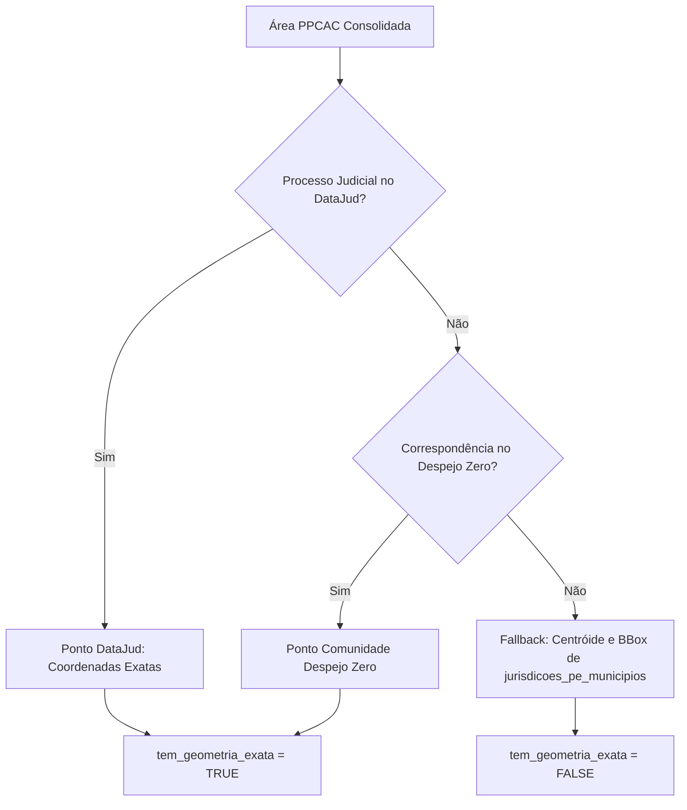

# Especificação Técnica: Ingestão de Dados e Filtro PPCAC (Programa de Prevenção de Conflitos Agrários Coletivos)

- **Data:** 2026-10-02
- **Status:** Aprovado para Implementação
- **Fonte Primária:** `data/raw/Planilha_da_Relacao_Conflitos_09.02.2026.xlsx`

---

## 1. Contexto e Objetivos

O **PPCAC** (*Programa de Prevenção de Conflitos Agrários Coletivos de Pernambuco*), regulamentado pela **Lei Estadual nº 18.441/2023** (originado pelo Decreto nº 52.339/2022), é a principal política pública de mediação, proteção e prevenção à violência no campo em Pernambuco. O programa é coordenado pela Secretaria de Justiça, Direitos Humanos e Prevenção à Violência (**SJDH**), atuando em articulação direta com a Comissão Estadual de Acompanhamento dos Conflitos Agrários (**CEACA/PE**) e o Ministério Público de Pernambuco (**MPPE**).

Esta especificação define:
1. O pipeline de extração, tratamento, higienização e carga (ETL) da planilha oficial de conflitos agrários coletivos do estado.
2. O modelo de dados relacional e espacial no PostGIS (`public.ppcac_conflitos_pe`).
3. O motor de resolução espacial hierárquica (Tier 1: correspondência exata via DataJud/DespejoZero/SIGEF; Tier 2: enquadramento municipal por `jurisdicoes_pe_municipios`).
4. A integração com o índice unificado de busca (`search_index`) e endpoints REST em `src/search_api.py`.
5. O componente frontend de navegação, detalhamento e isolamento cartográfico (`PpcacFilterComponent`).

---

## 2. Diagnóstico da Fonte de Dados (`Planilha_da_Relacao_Conflitos_09.02.2026.xlsx`)

### 2.1. Estrutura das Abas
- **`Planilha1` (Aba Mestra)**: Contém 120 linhas com dados efetivos (mais 200 linhas em branco residuais no Excel) totalizando **80 imóveis/áreas de conflito distintas**.
- **`PROCESSOS LUCAS`**: Subconjunto de 18 linhas cobrindo 6 áreas específicas (*Congaçari*, *Dois Rios*, *Fervedouro*, *Roncadorzinho*, *Várzea Velha*, *Riachão de Dentro*). O pipeline prioriza a `Planilha1` consolidada e aplica as padronizações municipais identificadas nesta aba (ex.: *Jaqueira* em vez de *Barro Branco*).

### 2.2. Dicionário de Campos e Estatísticas
| Coluna | Cabeçalho Original | Registros Preenchidos | Conteúdo e Regras de Tratamento |
| :---: | :--- | :---: | :--- |
| **A** | `Imóvel/Área` | 117 / 120 | Nome do imóvel rural, engenho, fazenda, sítio ou território tradicional (ex.: *Engenho Barro Branco*, *Engenho Roncadorzinho*). Linhas mescladas (linhas 14–16) devem sofrer propagação direta (*forward-fill*). |
| **B** | `Município` | 117 / 120 | Município de localização em PE. Padronizado contra a malha de 185 municípios (`jurisdicoes_pe_municipios`). |
| **C** | `Proprietário` | 61 / 120 | Pessoa física, espólio ou pessoa jurídica titular/reclamante do imóvel. |
| **D** | `Movimento Social` | 41 / 120 | Movimento ou entidade coletiva envolvida (CPT, MST, FETAPE, Associações Comunitárias). |
| **E** | `Nº do Processo Judicial` | 100 / 120 | Numerações de ações judiciais de reintegração/manutenção de posse, interdito e usucapião. 51 processos (57,3%) possuem correspondência ativa imediata com a base do DataJud (`processos_conflitos_judiciais`). |
| **F** | `Nº do Procedimento MPPE` | 60 / 120 | Procedimentos preparatórios e inquéritos civis do MPPE (padrão `020xx.000.xxx/xxxx`), frequentemente múltiplos por célula separados por quebras de linha. |
| **G** | `Nº do Processo SEI` | 81 / 120 | Processos administrativos eletrônicos estaduais (SJDH/CEACA), no padrão `00312...`, `22000...`, `39000...` e ofícios ministeriais/parlamentares. |
| **H** | *(Sem cabeçalho no Excel)* | 23 / 120 | Ano de referência/inclusão (`2023`, `2025`, `2026`) ou indicação de arquivamento (`ARQUIVADO`). |

### 2.3. Anomalias Identificadas e Sanitização Automatizada
1. **Deslocamento de Colunas (Linhas 104 a 120)**:
   - Em certas linhas sem proprietário ou movimento social, os números processuais foram inseridos nas colunas anteriores (ex.: linha 104 possui processo judicial na coluna C e SEI na coluna D; linha 108 possui MPPE na coluna C, SEI na coluna D e `ARQUIVADO` na coluna E).
   - *Solução ETL*: O script utiliza discriminadores via Expressões Regulares (Regex) para classificar o conteúdo de cada célula independentemente da coluna onde foi digitada:
     - CNJ: `\d{4,7}-?\d{2}\.?\d{4}\.?\d\.?\d{2}\.?\d{4}`
     - MPPE: `02\d{3}\.\d{3}\.\d{3}/\d{4}`
     - SEI: `\d{10}\.\d{6}/\d{4}-\d{2}` ou prefixos `OF\.` / `37000` / `39000` / `22000` / `00312`
2. **Células Multivaloradas**:
   - Quebra em listas estruturadas (`text[]` no PostgreSQL) a partir de delimitadores `\n` e `;`, removendo espaços e strings textuais espúrias (ex.: `"numero errado"`).
3. **Ausência de Geometria Própria**:
   - A planilha não contém coordenadas nem shapefiles; a espacialização depende da vinculação cruzada aos processos DataJud e à malha municipal.

---

## 3. Modelo de Dados Relacional e Espacial

### 3.1. Tabela PostGIS: `public.ppcac_conflitos_pe`

```sql
CREATE TABLE public.ppcac_conflitos_pe (
    id SERIAL PRIMARY KEY,
    nome_area TEXT NOT NULL,
    municipio TEXT NOT NULL,
    municipio_ibge INTEGER REFERENCES public.jurisdicoes_pe_municipios(codigo_ibge),
    proprietario TEXT,
    movimento_social TEXT,
    processos_judiciais TEXT[] DEFAULT '{}',
    processos_mppe TEXT[] DEFAULT '{}',
    processos_sei TEXT[] DEFAULT '{}',
    ano_referencia INTEGER,
    situacao TEXT NOT NULL DEFAULT 'ATIVO', -- 'ATIVO' | 'ARQUIVADO'
    observacoes TEXT,
    
    -- Cruzamentos Espaciais Precomputados
    datajud_processos TEXT[] DEFAULT '{}',
    despejo_zero_ids TEXT[] DEFAULT '{}',
    
    -- Geometria e Localização
    tem_geometria_exata BOOLEAN NOT NULL DEFAULT FALSE,
    centroid_lat DOUBLE PRECISION,
    centroid_lon DOUBLE PRECISION,
    bbox DOUBLE PRECISION[], -- [min_lon, min_lat, max_lon, max_lat]
    geometry GEOMETRY(Point, 4326),
    
    created_at TIMESTAMP WITH TIME ZONE DEFAULT NOW()
);

CREATE INDEX idx_ppcac_conflitos_geometry ON public.ppcac_conflitos_pe USING GIST(geometry);
CREATE INDEX idx_ppcac_conflitos_municipio ON public.ppcac_conflitos_pe(municipio_ibge);
CREATE INDEX idx_ppcac_conflitos_situacao ON public.ppcac_conflitos_pe(situacao);
```

### 3.2. Estratégia de Resolução Espacial Hierárquica


- **Tier 1 (Georreferenciamento Exato)**: A área adota as coordenadas exatas do processo no DataJud ou do ponto da comunidade no Despejo Zero. O campo `tem_geometria_exata` é marcado como `TRUE`.
- **Tier 2 (Enquadramento Municipal)**: Quando não há coordenadas conhecidas na base, o ponto adota o centróide municipal e o `bbox` abrange todo o município. O campo `tem_geometria_exata` é marcado como `FALSE`, instruindo o frontend a exibir um aviso institucional de delimitação cartográfica pendente.

---

## 4. Pipeline ETL (`src/etl_ppcac.py`)

O pipeline é executado via:
```bash
uv run python src/etl_ppcac.py
```

### Etapas de Execução:
1. **Leitura Excel com OpenPyXL**: Carrega `data/raw/Planilha_da_Relacao_Conflitos_09.02.2026.xlsx`.
2. **Propagação de Células Mescladas**: Resolve áreas multi-processuais (ex.: Engenho Congaçari).
3. **Classificação via Regex**: Extrai e normaliza processos judiciais, MPPE e SEI, corrigindo células deslocadas.
4. **Resolução de Municípios**: Vincula o nome municipal à tabela `jurisdicoes_pe_municipios`, obtendo `codigo_ibge`, geometria municipal e centróide.
5. **Vinculação com DataJud**: Cruza os números CNJ limpos com `processos_conflitos_judiciais.numero_processo` para capturar coordenadas lat/lon.
6. **Vinculação com Despejo Zero**: Realiza correspondência textual por proximidade de nome do engenho/comunidade em `despejo_zero_pe`.
7. **Carga no PostGIS**: Popula `ppcac_conflitos_pe` com índices espaciais e relacionais.
8. **Integração com Runner**: Adiciona a etapa `ppcac` ao script orquestrador `src/run_all_pipelines.py`.

---

## 5. Integração com o Índice de Busca e API

### 5.1. Busca Unificada (`src/build_search_index.py`)
Adiciona o registro de `ppcac_conflitos_pe` no array `SEARCH_SOURCES`:
```python
{
    "table": "ppcac_conflitos_pe",
    "label": ["nome_area"],
    "codes": ["processos_judiciais", "processos_mppe", "processos_sei"],
    "text": ["proprietario", "movimento_social", "situacao"],
    "place": ["municipio"],
    "ibge": ["municipio_ibge"],
    "searchable": True
}
```
*Garante que digitar "PPCAC", o nome de qualquer engenho ou o número de um procedimento do MPPE na barra de busca global localize e centralize o imóvel imediatamente.*

### 5.2. Endpoints REST em `src/search_api.py`

#### `GET /ppcac/areas`
Retorna as 80 áreas com estatísticas agregadas e suporte a filtros de consulta:
- Parâmetros: `situacao` (`ATIVO`, `ARQUIVADO`, `ALL`), `q` (termo de busca livre), `municipio` (filtro por nome).
- Resposta:
  - `total`: Quantidade de áreas retornadas.
  - `stats`: Totais de áreas ativas, arquivadas, com geometria exata, processos judiciais, MPPE e SEI.
  - `areas`: Array detalhado de objetos de área.

#### `GET /ppcac/filter-keys`
Retorna os identificadores de todas as feições associadas às 80 áreas para consumo pelo motor de filtros MapLibre do frontend:
```json
{
  "processos_conflitos_judiciais": ["0000082-63.2018.8.17.2940", "..."],
  "despejo_zero_pe": ["DZ-PE-142", "..."]
}
```

---

## 6. Interface do Usuário: `PpcacFilterComponent`

### 6.1. Posicionamento e Hierarquia Visual
- O componente reside em `frontend/src/app/ppcac-filter/` e é renderizado dentro da pilha de painéis flutuantes da esquerda (`.left-panels-stack`) em `app.html`.
- Respeita rigorosamente o padrão visual institucional: caixa limpa em tons neutros, sem emojis decorativos, códigos em monospace, tipografia nítida e contadores em badges.

### 6.2. Funcionalidades do Painel
1. **Cabeçalho Expansível**: Título *"PPCAC · Conflitos Agrários"*, badge com total de áreas (`80`), e botão de recolher/expandir.
2. **Campo de Busca Rápida**: Input interno para filtrar a lista local por nome da área, município ou movimento.
3. **Filtro de Situação**: Abas em pílula: `Todos (80)`, `Ativos (71)`, `Arquivados (9)`.
4. **Alternador "Isolar no Mapa"**:
   - Switch liga/desliga.
   - Quando ativado: aplica expressão de filtro no MapLibre (`['in', ['get', 'numero_processo'], ['literal', ppcacCnjList]]`), reduzindo a opacidade ou ocultando pontos judiciais externos ao PPCAC.
   - Exibe barra informativa com botão de desativação rápida.
5. **Lista de Áreas (Rolável)**:
   - Card com: Nome do Imóvel, Município, Proprietário, Movimento Social e pílulas de contagem processual (`Jud`, `MPPE`, `SEI`).
   - Tag de status: `ATIVO` (verde discreto) ou `ARQUIVADO` (cinza neutro).
   - Indicador de precisão: `Georreferenciado` ou `Sede Municipal`.
6. **Ação de Clique**:
   - Executa `map.fitBounds(area.bbox, { padding: 80, maxZoom: 15 })`.
   - Se `tem_geometria_exata = true`, seleciona o ponto judicial no mapa e abre o popup oficial.
   - Se `tem_geometria_exata = false`, abre o card institucional completo com aviso:
     > *Localizado no município de [Nome] — Georreferenciamento exato pendente de demarcação cartográfica.*

---

## 7. Plano de Verificação e Testes

1. **Testes do Pipeline ETL (`tests/test_etl_ppcac.py`)**:
   - Validação da extração de 80 registros canônicos a partir da planilha raw.
   - Verificação da recuperação das linhas com colunas deslocadas (104 a 120).
   - Validação da correta limpeza de processos judiciais e números do MPPE/SEI.
2. **Testes da API Backend (`tests/test_ppcac_api.py`)**:
   - `GET /ppcac/areas` retorna código HTTP 200 com 80 áreas e métricas corretas.
   - `GET /ppcac/filter-keys` retorna chaves válidas para DataJud e Despejo Zero.
   - Busca global em `search_index` retorna resultados para a consulta `"PPCAC"`.
3. **Testes Frontend (`frontend/src/app/ppcac-filter/ppcac-filter.component.spec.ts`)**:
   - Renderização dos cards e lista de 80 áreas.
   - Funcionamento do filtro de texto e pílulas de status.
   - Emissão correta dos eventos de seleção de área e isolamento no mapa.
4. **Build e Linter**:
   - Execução de `uv run pytest` no backend.
   - Execução de `pnpm build` no diretório `frontend/`.
